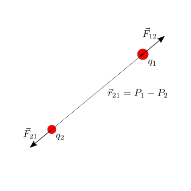
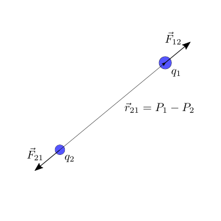
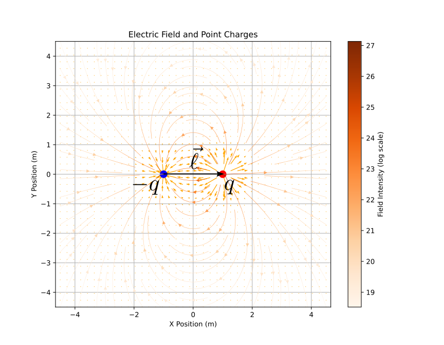
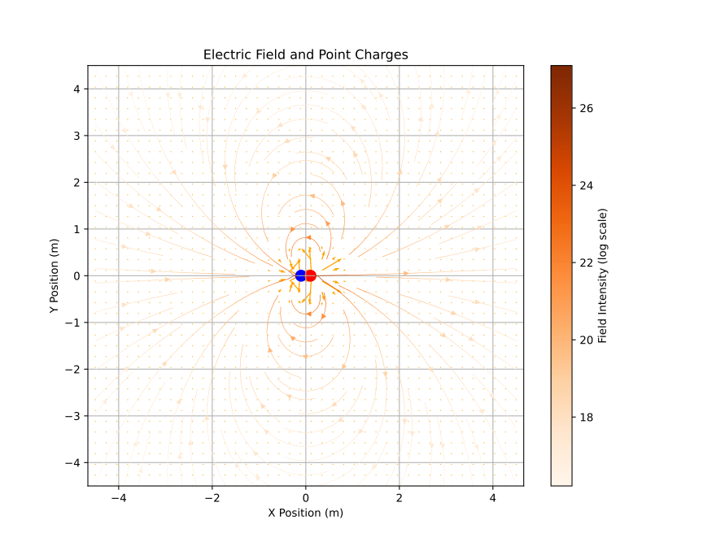
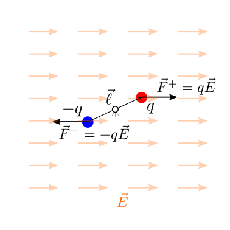
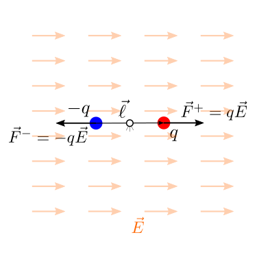
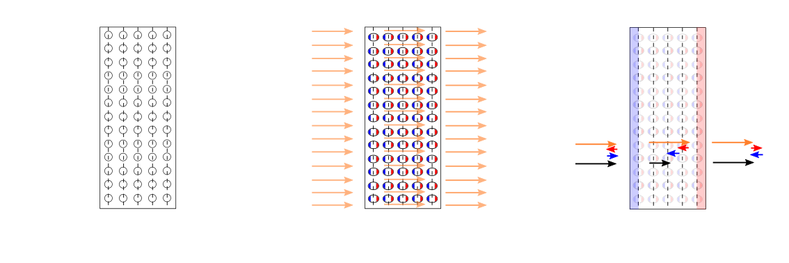
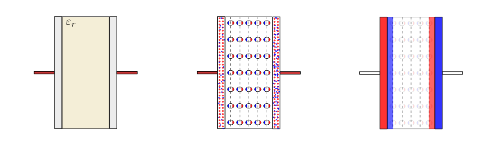

(physics-hs:electromagnetism:electrostatics)=
# Elettrostatica

(physics-hs:electromagnetism:electrostatics:coulomb)=
## Legge di Coulomb

Date due cariche elettriche puntiformi $q_1$, $q_2$, nella posizione $P_1$, $P_2$ nello spazio, la forza 

$$\vec{F}_{12} = k \frac{q_1 \, q_2}{|\vec{r}_{12}|^2} \, \hat{r}_{21} = \frac{1}{4 \pi \varepsilon}\frac{q_1 \, q_2}{|\vec{r}_{12}|^2} \, \hat{r}_{21}$$

essendo $\vec{r}_{21}$ il vettore che congiunge il punto $P_2$ con il punto $P_{1}$, $\vec{r}_{21} = \vec{r}_1 - \vec{r}_2$.

````{list-table}
:header-rows: 0
* - 
  - 
  - 
````

<!--
||||
|---|---|---|
-->
<!--
```{figure} ../../media/electrostatics-coulomb-pp.png
---
width: 30%
---
```
```{figure} ../../media/electrostatics-coulomb-pn.png
---
width: 30%
---
```
```{figure} ../../media/electrostatics-coulomb-nn.png
---
width: 30%
---
```
-->
<!--


-->

La scelta della definizione della costante di proporzionalità, $k = \frac{1}{4 \pi \varepsilon}$, viene fatta per ottenere un'espressione della [legge di Gauss per il campo elettrico](physics-hs:electromagnetism:electrostatics:maxwell:gauss) senza fattori numerici.

La costante $\varepsilon$ viene definita costante dielettrica del mezzo. Per cariche elettriche posizionate nello spazio "vuoto" (di materia ma non di proprietà fisiche), nell'espressione della legge di Coulomb compare la **costante dielettrica nel vuoto**,

$$\varepsilon_0 = 8.854 \cdot 10^{-12} \, C^2 \, N^{-1} \, m^{-2} \ .$$

Materiali isotropi lineari non dispersivi possono essere caratterizzati da una sola costante, la costante dielettrica del materiale. Questa caratteristica del materiale viene di solito definita come multiplo della costante dielettrica del vuoto, tramite la costante dielettrica relativa $\varepsilon_r$,

$$\varepsilon = \varepsilon_r \,\varepsilon_0 \ . $$


Vale il **principio di sovrapposizione delle cause e degli effetti**. In presenza di 3 cariche puntiformi, $q_1$, $q_2$, $q_3$, la forza totale agente sulla carica $q_1$ è uguale alla somma delle forze dovute a $q_2$ e $q_3$,

$$\vec{F}_1 = \vec{F}_{12} + \vec{F}_{13} = \frac{q_1 \, q_2}{4 \pi \varepsilon}\frac{\vec{r}_1 - \vec{r}_2}{|\vec{r}_1 - \vec{r}_2|^2} +  \frac{q_1 \, q_3}{4 \pi \varepsilon}\frac{\vec{r}_1 - \vec{r}_3}{|\vec{r}_1 - \vec{r}_3|^2} \ .$$

```{figure} ../../media/electrostatics-coulomb-psce.png
```

<!--
**todo**
- esperimento ed esercizio con elettroscopio e bilancia (similitudine con legge di gravitazione universale, ma doppia natura della carica elettrica + o -) **todo** riferimento alle prime esperienze sulle cariche elettriche
- **PSCE**
-->

(physics-hs:electromagnetism:electrostatics:charge:measurement)=
### Misura della carica elettrica
Un elettrometro è uno strumento di misura della carica elettrica. Una versione rudimentale di un elettrometro è la bilancia di torsione usata da Coulomb nei suoi esperimenti.

Il momento generato dalla forza di Coulomb sulla carica elettrica incognita $q_1$ dalla carica elettrica $q_2$ equilibria il momento elastico della bilancia di torsione. Se la struttura ha una equazione costitutiva il momento strutturale è proproporzionale alla rotazione, $M_z = K \, \theta$.

**todo** *svolgere conti qui o rimandare a esercizi?*

```{figure} ../../media/electrostatics-torsion-balance-coulomb.png
```

(physics-hs:electromagnetism:electrostatics:e-field)=
## Il campo elettrico
Data una distribuzione di cariche nello spazio, è possibile descriverla tramite l'effetto che avrebbe su una carica qualsiasi posta in un punto arbitrario dello spazio, introducendo la definizione di campo elettrico.

Viene data qui una **definizione operativa** del campo elettrico. Data una distribuzione di cariche, $q_i$, nei punti dello spazio $P_i$, si prende una carica test - di prova - di intensità nota $q^{test}$, che può essere posizionata in ogni punto $P$ dello spazio. E' inoltre possibile misurare la forza $\vec{F}(P; q^{test})$ agente sulla carica di prova dovuta all'interazione con la distribuzione di cariche in esame,

$$\begin{aligned}
  \vec{F}_{test}(P, q^{test})
  & = \sum_i \vec{F}_{test,i}(P) = \\
  & = \sum_i \frac{1}{4 \pi \varepsilon}\frac{q_i \, q_{test}}{|\vec{r}_{i,test,i}|^2} \, \hat{r}_{i,test} = \\
  & = q_{test} \sum_i \frac{1}{4 \pi \varepsilon}\frac{q_i}{|\vec{r}_{i,test,i}|^2} \, \hat{r}_{i,test} = \\
  & = q_{test} \, \vec{e}(P; \, q_i, \, P_i) \ .
\end{aligned}$$

Poichè la forza sulla carica di prova è proporzionale alla sua carica elettrica, è possibile descrivere l'effetto della distribuzione nota di cariche nello spazio con la funzione $\vec{e}(P; \, q_i, \, P_i)$. Questa funzione viene definita **campo elettrico** della distribuzione delle cariche.

Viceversa, noto il campo elettrico di una distribuzione di cariche, la forza agente su una carica elettrica $q$ posta nel punto $P$ dello spazio è

$$\vec{F} = q \, \vec{e}(P) \ .$$

- **todo** Poichè il PSCE vale per la forza, il **PSCE** vale per il campo elettrico

(physics-hs:electromagnetism:electrostatics:e-field:conservative)=
### Campo conservativo
Come mostrato (**todo** <span style="color:red"> ah sì? fare riferimenti qui?</span>) per il campo gravitazionale, anche il campo elettrostatico è un campo conservativo.

Il lavoro fatto dal campo su una carica che descrive una traiettoria $\gamma$, con estremi $A$, $B$ è uguale a

$$\begin{aligned}
  L & = \int_{\gamma} \vec{F}(P) \cdot d \vec{r} = - \int_{\gamma} \nabla U(P) \cdot d \vec{r} = - \Delta U = U(A) - U(B) \\
    & = q \, \int_{\gamma} \vec{e}(P) \cdot d \vec{r} = - q \int_{\gamma} \nabla V(P) \cdot d \vec{r} = - q \, \Delta V = q \, \left( V(A) - V(B) \right) \\
\end{aligned}$$

avendo definito l'**energia potenziale** $U(P)$ del sistema di cariche che produce il campo elettrico $\vec{e}(P)$ e il **potenziale elettrico** $V(P)$ come l'energia potenziale per unità di carica $q$. Sia l'energia potenziale sia il potenziale sono definiti a meno di una costante additiva.

Il potenziale generato da una carica $q_i$ posizionata punto "potenziante" $P_i$ nel punto "potenziato" $P$

$$V_i(P) = \frac{1}{4 \pi \varepsilon} \frac{q_i}{|\vec{r}_i|} \ ,$$

con $\vec{r}_i = P - P_i$. Poichè il PSCE vale per la forza e il campo elettrico, il **PSCE** vale per il potenziale, e quindi il potenziale elettrico generato da un sistema di cariche è la somma del potenziale elettrico generato dalle singole cariche,

$$V_i(P) = \frac{1}{4 \pi \varepsilon} \sum_i \frac{q_{i}}{\left|\vec{r}_{i}\right|} $$

(physics-hs:electromagnetism:electrostatics:e-field:energy)=
### Energia potenziale di una distribuzione di cariche

L'energia potenziale di un sistema di cariche è uguale al lavoro (<span style="color:red">delle forze esterne = - lavoro forza elettrica</span>) fatto per costruire tale distribuzione. Poiché in meccanica classica l'energia è definita a meno di una costante additiva arbitraria, si può considerare la condizione di riferimento con le cariche poste all'"infinito" o, meglio, infinitamente distanti una dalle altre.

Per un sistema di cariche puntiformi, l'energia potenziale del sistema è uguale alla somma dell'energia potenziale tra le singole coppie di cariche

$$E^{pot} = \sum_{\{i,j\}, i \ne j} V_{ij} = \sum_{\{i,j\}, i \ne j} \frac{1}{4 \pi \varepsilon} \frac{{q}_{i} \, q_{j}}{r_{ij}} \ ,$$

senza ripetere la sommatoria sulle coppie con gli elementi invertiti.

Questa espressione dell'energia immagazzinata nel sistema di cariche può essere dimostrata con il calcolo diretto del lavoro necessario per posizionare le cariche nello spazio. Di solito si considera una condizione di riferimento che fissa la costante arbitraria dell'energia per avere energia nulla quando le cariche sono all'infinito.
Vengono qui date due dimostrazioni, seguendo due modi diversi per posizionare le cariche:
- posizionando una carica alla volta
- posizionando tutte le cariche contemporaneamente

Vengono date due dimostrazioni per mostrare diversi approcci allo stesso problema, e per mettere in evidenza che il risultato dell'espressione dell'energia non dipende dal modo in cui si costruisce il sistema, coerentemente con la natura conservativa della forza elettrostatica (il lavoro non dipende dal percorso).


<!--
In assenza di altri fenomeni, l'energia potenziale del sistema di cariche è uguale al lavoro fatto per costruire il sistema di cariche. Ad esempio, si può costruire il sistema di cariche
-->


```{dropdown} Posizionando una carica alla volta
$$\begin{aligned}
  L^{ext}_1 & = 0 \\
  L^{ext}_2 & = \frac{1}{4 \pi \varepsilon} \frac{q_1 \, q_2}{r_{12}}  \\
  L^{ext}_3 & = \frac{1}{4 \pi \varepsilon} \frac{q_1 \, q_3}{r_{13}} + \frac{1}{4 \pi \varepsilon} \frac{q_2 \, q_3}{r_{23}}  \\
            & ... \\
  L^{ext}_n & = \sum_{j=1}^{n-1} \frac{1}{4 \pi \varepsilon} \frac{q_1 \, q_n}{r_{1n}} \\
\end{aligned}$$

$$E^{pot} = L^{ext} = \sum_i L^{ext}_i = \sum_{\{i, j\}, i \ne j} \frac{1}{4 \pi \varepsilon} \frac{q_1 \, q_j}{r_{ij}} \ .$$
```

```{dropdown} Posizionando le cariche contemporanamente
Posizionando tutte le cariche contamporaneamente con una "scalatura" delle distanze, $\vec{r}_i(\alpha) = \frac{\vec{r}_i}{\alpha}$, $\alpha \in (0, 1]$, il lavoro delle forze elettriche è

$$\begin{aligned}
  dL_i(\alpha) & = \sum_{j \ne i} \vec{F}_{ij}(\alpha) \cdot d \vec{r}_i(\alpha) = \\
  & = \sum_{j \ne i} \frac{q_i \, q_j}{4 \pi \varepsilon}  \frac{1}{\left| \frac{\vec{r}_i}{\alpha} - \frac{\vec{r}_j}{\alpha}\right|^2} \hat{r}_{ji} \cdot \left(-\frac{\vec{r}_i}{\alpha^2}\right) \, d \alpha = \\
  & = - \sum_{j \ne i} \frac{q_i \, q_j}{4 \pi \varepsilon}  \frac{\hat{r}_{ji} \cdot\vec{r}_i}{\left| \vec{r}_i - \vec{r}_j\right|^2}  \, d \alpha
\end{aligned}$$

$$\begin{aligned}
 dL(\alpha) & = \sum_i d L_i = \\
  & = - \sum_{i} \sum_{j \ne i} \frac{q_i \, q_j}{4 \pi \varepsilon}  \frac{\hat{r}_{ji} \cdot\vec{r}_i}{\left| \vec{r}_i - \vec{r}_j\right|^2}  \, d \alpha = \\
  & = - \sum_{\{i,j\}, i \ne j} \frac{q_i \, q_j}{4 \pi \varepsilon}  \frac{\hat{r}_{ji} \cdot \left( \vec{r}_i - \vec{r}_j \right)}{\left| \vec{r}_i - \vec{r}_j\right|^2}  \, d \alpha = \\
  & = - \sum_{\{i,j\}, i \ne j} \frac{q_i \, q_j}{4 \pi \varepsilon}  \frac{1}{r_{ij}}  \, d \alpha  \ ,
\end{aligned}$$

e il lavoro diventa

$$
 L = \int_{\alpha = 0}^{1} dL (\alpha) =  - \int_{\alpha=0}^{1} \sum_{\{i,j\}, i \ne j} \frac{q_i \, q_j}{4 \pi \varepsilon}  \frac{1}{r_{ij}}  \, d \alpha = - \sum_{\{i,j\}, i \ne j} \frac{q_i \, q_j}{4 \pi \varepsilon}  \frac{1}{r_{ij}} \ .
$$
```

````{prf:example} Il dipolo elettrico
:label: electric-dipole

Un dipolo elettrico viene definito come un sistema formato da due cariche di intensità $-q$ e $q$ poste in due punti dello spazio $P_{-}$, $P_{+} = P_{-}$ dal vettore $\vec{\ell}$,

$$P_+ = P_{-} + \vec{\ell} \ ,$$

nel limite per $|\vec{\ell}| \rightarrow 0$ e $q \rightarrow + \infty$ in modo tale da avere il prodotto 

$$\vec{P} := q \vec{\ell} \ ,$$

finito. Il vettore $\vec{P} = q \vec{\ell}$ è l'intensità del dipolo. 

Il campo elettrico prodotto da un dipolo può essere calcolato usando il principio di sovrapposizione delle cause (le due cariche elettriche di intensità opposta) e gli effetti (i campi prodotti dalle due cariche), calcolando il limite per $|\vec{\ell}| \rightarrow 0$ e $q \rightarrow + \infty$ con $\vec{P} = q \vec{\ell}$ finito.

Il modello di dipolo elettrico può essere utilizzato per rappresentare la **polarizzazione** di un [materiale dielettrico](physics-hs:electromagnetism:electrostatics:e-field:media:dielectrics).


```{list-table}
:header-rows: 0
* - 
  - 
```

````

````{prf:example} Il dipolo elettrico in un campo elettrico esterno uniforme
:label: electric-dipole-ext-e-field

```{list-table}
:header-rows: 0
* - 
  - 
```

````

(physics-hs:electromagnetism:electrostatics:e-field:media)=
## Campo elettrico nei materiali

L'interazione dei materiali con un campo elettrico viene descritta qui e nella sezione [Corrente elettrica nella materia](physics-hs:electromagnetism:electric-current:media) del capitolo successivo. E' frequente analizzare la risposta di un materiale a un campo elettrico utilizzando una classificazione delle cariche elettriche presenti nel materiale in **cariche libere** (cariche elettriche non vincolate ai singoli atomi del materiale, ma condivise tra di essi, come gli *elettroni di conduzione* nei *metalli*) e **cariche vincolate** (cariche elettriche vincolate ai rispettivi nuclei, come gli elettroni degli orbitali più interni in un solido metallico, o gli elettroni dei materiali non conduttori - che hanno tutti gli elettroni vincolati a singoli atomi, e non condivisi all'interno dell'intero materiale).

A seconda della loro interazione con un campo elettrico e alla loro capacità di condurre corrente, i materiali possono essere classificati come:
- materiali conduttori:
  - permettono il passaggio della corrente elettrica, cioè il moto di **cariche elettriche libere**
  - non mostrano polarizzazione, poiché le cariche libere rispondono a un campo elettrico esterno, disponendosi in una configurazione tale da annullare il campo elettrico totale all'interno del conduttore, si veda []() e l'esempio della [gabbia di Faraday]()
- materiali isolanti:
  - non permettono il passaggio di corrente elettrica. 
  - Alcuni materiali isolanti, detti **dielettrici**, rispondono comunque a un campo elettrico "esterno" sotto forma di polarizzazione, cioè con un'orientazione della distribuzione di carica locale associata ai singoli atomi del materiale.
- materiali semi-conduttori

In generale, i materiali isotropi e lineari conduttori e dielettrici possono essere rappresentati da un'equazione costitutiva dall'espressione

$$\vec{d} := \varepsilon_0 \vec{e} + \vec{p} = \varepsilon \vec{e} = \varepsilon_r \varepsilon_0 \vec{e} \ ,$$

avendo introdotto $\vec{p}$ il campo di **polarizzazione** ($\vec{p} = \varepsilon_0 ( \varepsilon_r - 1) \vec{e}$ per materiali isotropi lineari) come risposta del materiale a campi elettrici esterni, e il campo di spostamento $\vec{d}$ che riassume gli effetti del campo elettrico "esterno" $\vec{e}$ e della polarizzazione locale del materiale $\vec{p}$. Nel caso di materiali isotropi e lineari, il campo di spostamento $\vec{d}$ è proporzionale al campo elettrico "esterno" $\vec{e}$ e il ceofficiente di proporzionalità è definito costante dielettrica del materiale, $\varepsilon$, e può essere scritta come prodotto della costante dielettrica del vuoto e la costante dielettrica relativa del materiale (adimensionale),

$$\varepsilon_r = \frac{\varepsilon}{\varepsilon_0} \ .$$

Tipicamente:
- i materiali conduttori che mostrano un polarizzazione trascurabile, $\vec{p} \sim \vec{0}$, hanno $\varepsilon_r \sim 1$, $\varepsilon \sim \varepsilon_0$. La risposta a un campo elettrico esterno si manifesta in una disposizione delle cariche libere
- materiali dielettrici manifestano una polarizzazione che si manifesta con una costante dielettrica relativa, $\varepsilon_r > 1$, $\varepsilon > \varepsilon_0$


(physics-hs:electromagnetism:electrostatics:e-field:media:conductors)=
### Campo elettrostatico nei conduttori
In condizioni statiche il campo elettrico nei conduttori è identicamente nullo. Le cariche elettriche (libere) si concentrano quindi in zone di superficie sottile e possono essere modellate in prima approssimazione con densità di carica superficiale. Se in una regione dello spazio il campo elettrico è identicamente nullo, allora i punti in quella regione hanno lo stesso pontenziale. E' quindi possibile affermare che nei punti all'interno di un materiale conduttore in condizioni di elettrostatica (o di resistività nulla o trascurabile, come sarà spiegato nel prossimo capitolo sulla [corrente elettrica](physics-hs:electromagnetism:electric-current) per la [conduzione nei solidi conduttori](physics-hs:electromagnetism:electric-current:solids:conductor)),

- il campo elettrico è nullo $\vec{e}(P) = \vec{0}$
- hanno lo stesso valore di potenziale, $v(P) = \overline{v}$, cioè sono **equipotenziali**.

```{note}
Per materiali [conduttori di Ohm](physics-hs:electromagnetism:electric-current:solids:conductor:ohm), il campo elettrico è proporzionale alla [densità di corrente elettrica](electric-current-density:def) tramite la resistività del materiale. In condizioni statiche, il moto (medio) delle cariche è nullo; quindi la corrente elettrica è nulla; e quindi il campo elettrico all'interno del materiale conduttore è nullo.

**todo** 
- Motivare con criterio di minima energia
- Mostrare esempi (con **effetto punta**):
  - esempio 1-dimensionale, con soluzione analitica
  - esempio 2-dimensionale, con script
```

```{prf:example} Distribuzione di carica in un guscio sferico conduttore - simmetria sferica
:class: dropdown

**todo** Risolvere usando il [teorema di Gauss](physics-hs:electromagnetism:electrostatics:maxwell:gauss) e quindi spostare dopo il capitolo sulle [equazioni di Maxwell in elettrostatica](physics-hs:electromagnetism:electrostatics:maxwell)?

Una carica puntiforme $Q_a$ viene posta nel centro di un guscio sferico di un materiale conduttore a sua volta con con carica totale $Q_b$. Non ci sono altre cause del campo elettrico. Si vuole determinare la distribuzione di carica del problema e il campo elettrico nello spazio.

Sfruttando il comportamento dei conduttori in elettrostatica, si stabilisce che la distribuzione di carica nel conduttore è concentrata sulle superficie del guscio sferico. La distribuzione superficiale di carica sulla superficie interna deve essere tale da annullare il campo elettrico generato dalla carica interna.

Quindi:
- per $r < R_1$: $\vec{e}(\vec{r}) = \frac{Q_a}{4 \pi \varepsilon_0}\frac{\vec{r}}{|\vec{r}|^3} $

- su $r = R_1$: $\sigma_1 S_1 + Q_a = 0$ e quindi $\sigma_1 = -\frac{Q_a}{4 \pi R_1^2}$

- per $r \in (R_1, R_2)$, $\vec{e}(\vec{r}) = \vec{0}$

- su $r = R_2$: $\sigma_1 S_1 + \sigma_2 S_2 = Q_b$ e quindi 

  $$\sigma_2 = - \frac{R_1^2}{R_2^2} \sigma_1 + \frac{Q_b}{4 \pi R_2^2} = \frac{Q_a + Q_b}{4 \pi R_2^2}$$

- per $r > R_2$:

  $$\vec{e}(\vec{r}) = \frac{Q_a + Q_b}{4 \pi \varepsilon_0} \frac{\vec{r}}{|\vec{r}|^3}$$

**todo** aggiungere esempio numerico?

```

```{prf:example} Gabbia di Faraday
```

(physics-hs:electromagnetism:electrostatics:e-field:media:dielectrics)=
### Campo elettrostatico nei dielettrici
- polarizzazione: descrizione
- polarizzazione equivalente a una distribuzione di volume di [dipoli elettrici](), vedi {prf:ref}`electric-dipole`, equivalente a una distribuzione di carica superficiale e una distribuzione di carica di volume solo se polarizzazione non uniforme

A differenza dei materiali conduttori, gli elettroni sono localizzati attorno ai nuclei degli atomi del materiale e non esistono elettroni liberi di muoversi all'interno del materiale - come sono gli elettroni di conduzione nei conduttori. Quando un materiale dielettrico viene sottoposto a un campo elettrico esterno, esso risponde con una ridistribuzione locale di carica vincolata ai singoli atomi: benché ogni atomo rimanga elettricamente neutro, avviene una ridistribuzione delle cariche di segno opposto presenti all'interno di ogni atomo, che può quindi essere rappresentato come un [dipolo elettrico]().

La ridistribuzione delle cariche elettriche all'interno del materiale crea a sua volta un campo elettrico, che in un modello continuo della materia può essere rappresentato come una densità di volume di dipoli elettrici, $\vec{p}(\vec{r},t)$: è possibile dimostrare che[^dipole-distribution-proof] distribuzione di dipoli elettrici nel volume corrisponde agli effetti di: 1) una densità di carica sulla superficie del volume di intensità $\vec{p} \cdot \hat{n}$ e 2) di una densità di volume di carica di intensità $\nabla \cdot \vec{p}$, termine nullo nel caso in cui la polarizzazione sia uniforme.

[^dipole-distribution-proof]: Qua bisogna fidarsi e provare a verificare la ragionevolezza dell'affermazione, o avere gli strumenti matematici per comprendere la [dimostrazione](https://basics2022.github.io/bbooks-physics-electromagnetism/ch/media.html#distribuzione-continua-di-dipoli).

Questa affermazione viene utilizzata per analizzare la risposta di un materiale dielettrico isotropo in un campo elettrico uniforme. Facendo riferimento alla figure **todo**, la polarizzazione è equivalente alla distribuzione di carica superficiale $\sigma_p = \vec{p} \cdot \hat{n} > 0$ sulla faccia di destra, $-\sigma_p$ sulla faccia di sinistra. Riconoscendo l'analogia con un [condensatore piano](physics-hs:electromagnetism:electrostatics:capacitor:flat), il campo elettrico all'esterno del dielettrico rimane invariato; all'interno del dielettrico, il campo elettrico vale

$$\vec{e} = \vec{E} - \frac{\sigma_p}{\varepsilon_0} \hat{x} \ .$$

Non essendoci cariche libere nel sistema, il campo di spostamento $\vec{d}$ è uniforme e quindi $\vec{d} = \varepsilon_0 \vec{E}$

$$\vec{e} = \frac{1}{\varepsilon_0} \left( \vec{d} - \vec{p} \right) 
  = \vec{E} - \frac{\vec{p}}{\varepsilon_0} 
  = \vec{E} - \frac{\varepsilon_r - 1}{\varepsilon_r} \vec{E} 
  = \frac{1}{\varepsilon_r} \vec{E}  \ .
$$ 

da cui 

$$\vec{p} = \sigma_p \hat{x} = \frac{\varepsilon_r - 1}{\varepsilon_r} \vec{d} = \varepsilon_0 \frac{\varepsilon_r - 1}{ \varepsilon_r} \vec{E}  \ .$$


```{list-table}
:header-rows: 0
* - 
```

```{prf:example} Distribuzione di carica in un guscio sferico dielettrico senza carica netta - simmetria sferica
:class: dropdown

**todo** aggiungere la possibilità di cariche libere. E' necessario fare ipotesi sulla distribuzione delle cariche libere? O qualche principio fisico fornisce la loro distribuzione? $\nabla \cdot \vec{d} = \rho_f$

```

Per materiali lineari isotropi,

$$\vec{d} := \varepsilon \vec{e} = \varepsilon_0 \vec{e} + \vec{p}$$

$$\begin{aligned}
  \vec{d} & = \varepsilon \vec{e} = \varepsilon_r \varepsilon_0 \vec{e}  \\
  \vec{p} & = \vec{d} - \varepsilon_0 \vec{e} = \varepsilon_0 (\varepsilon_r - 1) \vec{e} = \frac{\varepsilon_r - 1}{\varepsilon_r} \vec{d}  \\
\end{aligned}$$

Usando la relazione tra il campo di polarizzazione e la carica vincolata
 
$$\Phi_{\partial V}(\vec{p}) = - Q_b \ ,$$
$$\Phi_{\partial V}(\vec{d}) =   Q_f \ ,$$


**todo** polarizzazione, cariche libere e cariche "vincolate"

(physics-hs:electromagnetism:electrostatics:maxwell)=
## Verso le equazioni di Maxwell
In questa sezione vengono riassunti i risultati del capitolo in due equazioni che faranno parte delle equazioni di Maxwell e in generale dei principi dell'elettromagnetismo classico.

Fare riferimento a:
- [equazioni di Maxwell per l'elettrostatica](physics-hs:electromagnetism:electrostatics:maxwell)
- [equazioni di Maxwell e principi dell'elettromagnetismo classico in regime stazionario](physics-hs:electromagnetism:electromagnetism-steady:maxwell)
- [equazioni di Maxwell e principi dell'elettromagnetismo classico](physics-hs:electromagnetism:electromagnetism-general:maxwell)

(physics-hs:electromagnetism:electrostatics:maxwell:gauss)=
### Legge di Gauss per il flusso del campo elettrico

La legge di Gauss per il campo di spostamento $\vec{d} := \varepsilon_0 \vec{e} + \vec{p}$ afferma che il flusso del campo di spostamento attraverso una superficie chiusa $\partial V$ è uguale alla carica elettrica libera $Q_{V,f}$ contenuta nel volume $V$,

  $$\Phi_{\partial V}(\vec{d}) = Q_{V,f} \ .$$

```{dropdown} Dimostrazione della legge di Gauss
**Dimostrazione per una carica puntiforme e una superficie sferica.**
Il calcolo diretto del flusso del campo elettrico generato da una carica puntiforme attraverso una superficie sferica di raggio $r$ centrata nella carica

$$\Phi_{S^{sphere}}(\vec{d}) = \oint_{S^{sphere}} \vec{d} \cdot \hat{n} = \oint_{S^{sphere}} \frac{1}{4 \pi }\frac{q}{r^2} \underbrace{\hat{r} \cdot \hat{r}}_{=1} \ .  $$

L'integranda è costante, essendo $r$ costante sulla superficie sferica, e quindi si riduce al prodotto della funzione integranda per l'estensione del dominio di integrazione, qui la superficie estenra della sfera. Ricordando che la superficie di una superficie sferica di raggio $r$ è $S = 4 \pi r^2$, si ottiene l'espressione della legge di Gauss per il campo elettrico di una carica puntiforme attraverso una superficie sferica,

$$\Phi_{S^{sphere}}(\vec{d}) = 4 \, \pi \, r^2 \frac{1}{4 \, \pi \, r^2} q = q \ .$$

**todo** obs: andamento del campo come $r^{-2}$ implica andamento del flusso costante attraverso superfici che sottengono lo stesso **angolo solido**

**todo** ... altra osservazione che ora non ricordo...

**Dimostrazione per una carica puntiforme e per una superficie arbitraria.**
Usando l'osservazione sull'andamento del campo, e la definizione di angolo solido

$$
\oint_S \frac{q}{4 \pi} \frac{1}{r^2} \hat{r} \cdot \hat{n} \, dS =
\frac{q}{4 \pi} \oint_S \frac{1}{r^2} \hat{r} \cdot \hat{n} \, dS =
\frac{q}{4 \pi} \oint_{\Omega} d \Omega = q \ .
$$


**Dimostrazione per una distribuzione di carica qualsiasi e superficie arbitraria.**
Avendo dimostrato la legge di Gauss per una carica puntiforme attraverso una superficie arbitraria, la legge di Gauss per il campo $\vec{d}$ generato da una distribuzione di carica qualsiasi segue immediatamente, ricordando che vale il PSCE

$$\Phi_{\partial V}(\vec{d}_i) = q_i$$

$$\sum_i \Phi_{\partial V}(\vec{d}_i) = \Phi_{\partial V} \left(\sum_i \vec{d}_i \right) = \sum_i q_i$$

$$\Phi_{\partial V}(\vec{d}) = Q_V$$

```

(physics-hs:electromagnetism:electrostatics:maxwell:faraday)=
### Legge di Faraday, in elettrostatica
- La legge di Faraday in elettrostatica è una diretta conseguenza della conservatività del campo elettrico

  $$\Gamma_{\partial S}(\vec{e}) = \oint_{\partial S} \vec{e} \cdot \hat{t} = 0 \ .$$ (eq:faraday:steady)

- Questa equazione è valida **solo** in un regime elettrostatico: la forma generale dell'equazione di Faraday prevede un termine dipendente dal tempo, che è identicamente nullo nel regime elettrostatico.

```{dropdown} Dimostrazione della legge di Faraday
**Dimostrazione per una carica puntiforme e un percorso circolare.**
Il calcolo diretto della circuitazione del campo elettrico generato da una carica puntiforme lungo un percorso circolare $\partial S = \ell^{circle}$ di raggio $r$ centrato nella carica

$$\Gamma_{\ell^{circle}}(\vec{e}) = \oint_{\ell^{circle}} \vec{e} \cdot \hat{t} = \oint_{\ell^{circle}} \frac{1}{4 \pi \varepsilon}\frac{q}{r^2} \underbrace{\hat{r} \cdot \hat{t}}_{=0} = 0 \ ,  $$

poiché il versore tangente al percorso circolare è ortogonale al campo elettrico, diretto in direzione radiale.

**Dimostrazione per una carica puntiforme e un percorso arbitrario.**

**Dimostrazione per una distribuzione di carica qualsiasi e percorso arbitrario.**
Avendo dimostrato la legge di Faraday nel caso stazionario per una carica puntiforme lungo un percorso arbitrario, la legge di Faraday in regime stazionario per il $\vec{e}$ generato da una distribuzione di carica qualsiasi segue immediatamente, ricordando che vale il PSCE

$$\Gamma_{\partial S}(\vec{e}_i) = 0$$

$$\sum_i \Gamma_{\partial S}(\vec{e}_i) = \Gamma_{\partial S} \left(\sum_i \vec{e}_i \right) = 0$$

$$\Gamma_{\partial S}(\vec{e}) = 0$$

```
(physics-hs:electromagnetism:lorentz:electric)=

(physics-hs:electromagnetism:electrostatics:capacitor)=
## Condensatore

Un condensatore è un componente elettrico in grado di immagazzinare l'energia associata a una distribuzione di cariche e un campo elettrico stazionario. Un condensatore rimane elettricamente neutro e immagazzina l'energia grazie alla separazione di cariche positive e negative, creata grazie a una differenza di potenziale ai capi del condensatore. 

(physics-hs:electromagnetism:electrostatics:capacitor:flat)=
### Condensatore piano

Un condensatore piano viene qui studiato nell'approssimazione di condensatore piano infinito, per poter sfruttare la simmetria del problema trascurando gli effetti di bordo. Si ipotizza inoltre che le pareti del condensatore - le sue *armature* - siano sottili da poter rappresentare la distribuzione di carica elettrica come una densità superficiale sull'armatura.

```{list-table}
:header-rows: 0
* - 
```

```{list-table}
:header-rows: 0
* - 
```

Sfruttando la simmetria del problema - omogeneo nelle direzioni parallele alle armature del condensatore - e applicando la [legge di Gauss per ilcampo di spostamento $\vec{d}$](physics-hs:electromagnetism:electrostatics:maxwell:gauss), si ottiene la relazione tra il campo elettrico tra le armature del condensatore, la densità di carica superficiale $\sigma$, e la costante dielettrica del mezzo tra le armature,

**todo** aggiungere immagini e dettagli

$$e = \frac{\sigma}{\varepsilon}$$

$$Q = \sigma \, A$$

$$v = \int_{\ell} \vec{e} \cdot d \vec{r} = \ell \, e$$

$$ Q = \sigma \, A = \varepsilon \, e \, A = \frac{\varepsilon \, \ell}{A} \, v = C \, v \ ,$$

definendo la capacità $C$ (vedi {prf:ref}`capacitor-capacity`) come costante di proporzionalità tra la carica elettrica immagazzinata nelle armature del condensatore e la differenza di potenziale ai capi del condensatore stesso, e avendo trovato l'espressione della capacità di un condensatore piano, 

$$C = \frac{\varepsilon \, A}{\ell} \ .$$

```{prf:definition} Capacità di un condensatore
:label: capacitor-capacity

La capacità di un condensatore può essere definita come il rapporto tra carica immagazzinata su un'armatura e differenza di potenziale tra le armature,

$$C = \frac{Q}{v} \ .$$

```

```{dropdown} Condensatore cilindrico
Utilizzando il [teorema di Gauss per il campo di spostamento $\vec{d}$](physics-hs:electromagnetism:electrostatics:maxwell:gauss), tra i cilindri del condensatore il campo elettrico è ha direzione radiale e valore assoluto $\propto r^{-1}$,

$$\vec{e}(r) = \frac{1}{2 \pi \varepsilon} \frac{Q}{r} \hat{r} \ .$$

dove la carica totale della superficie sferica con distribuzione di carica uniforme è data dal prodotto della densità superficiale di carica e la superficie, $Q = \sigma \, S_1 = \sigma \, 4 \pi \, R_1^2$.
La differenza di potenziale tra le due armature è quindi

$$v = \int_{\ell} \vec{e}(r) \cdot \hat{r} = \int_{r=R_1}^{R_2} \frac{Q}{2 \pi r} dr = \frac{1}{2 \pi \varepsilon} \left.\ln r \right|_{R_1}^{R_2} = \frac{1}{2 \pi \varepsilon} \ln \dfrac{R_2}{R_1} \, Q \ .$$

La formula precedente e la definizione di capacità, $Q = C \, v$, consente di determinare la capacità di un condensatore sferico ideale,

$$C = 2 \pi \, \varepsilon \,  \frac{1}{\ln \frac{R_2}{R_1}} \ .$$
```

```{dropdown} Condensatore sferico
Utilizzando il [teorema di Gauss per il campo di spostamento $\vec{d}$](physics-hs:electromagnetism:electrostatics:maxwell:gauss), tra le sfere del condensatore il campo elettrico è ha direzione radiale e valore assoluto $\propto r^{-2}$,

$$\vec{e}(r) = \frac{1}{4 \pi \varepsilon} \frac{Q}{r^2} \hat{r} \ .$$

dove la carica totale della superficie sferica con distribuzione di carica uniforme è data dal prodotto della densità superficiale di carica e la superficie, $Q = \sigma \, S_1 = \sigma \, 4 \pi \, R_1^2$.
La differenza di potenziale tra le due armature è quindi

$$v = \int_{\ell} \vec{e}(r) \cdot \hat{r} = \int_{r=R_1}^{R_2} \frac{Q}{4 \pi r^2} dr = - \frac{1}{4 \pi \varepsilon} \frac{1}{r} \bigg|_{R_1}^{R_2} = \frac{1}{4 \pi \varepsilon} \left(\frac{1}{R_1} - \frac{1}{R_2} \right) \, Q \ .$$

La formula precedente e la definizione di capacità, $Q = C \, v$, consente di determinare la capacità di un condensatore sferico ideale,

$$C = 4 \pi \, \varepsilon \,  \frac{R_1 \, R_2}{R_2 - R_1} \ .$$
```

### Bilancio di energia in un condensatore

**todo** Definire l'energia immagazzinata nel condensatore e verificarne l'espressione con diverse forme di lavoro realizzabile:
- lavoro elettrico?
- lavoro meccanico? Un-comment

<!--
Dopo aver staccato l'alimentazione del condensatore, e connesso a terra le armature del condensatore una in maniera rigida e una con una molla lineare e allungamento nullo nella configurazione iniziale, si cerca la condizione di equilibrio.

$$F = E \sigma A = \sigma A \frac{\sigma}{\varepsilon} = \frac{A}{\varepsilon} Q^2$$

$$L = F \, x$$

$$L^{molla} = \frac{1}{2} k x^2$$
-->

### Configurazioni di condensatori

- condensatori in serie
- condensatori in parallelo

## Moto di una carica in un campo elettrico
Il moto di una corpo puntiforme di massa $m$ e carica elettrica $q$ in una regione dello spazio nel quale c'è un campo elettrico $\vec{e}(\vec{r},t)$ è soggetto a una forza esterna,

$$\vec{F}^{el} = q \, \vec{e}(P) \ ,$$ (eq:force:lorentz:electric)

Come si vedrà in seguito nell'ambito dell'elettromagnetismo, questa espressione della forza è un caso particolare della [forza di Lorentz](physics-hs:electromagnetism:lorentz), cioè la forza agente su una carica elettrica immersa in un campo elettromagnetico, nel caso in cui il campo magnetico sia nullo, $\vec{b} = \vec{0}$, o nelle altre condizioni che annullano il termine $\vec{b} \times \vec{v}$ nella formulaa {eq}`eq:force:lorentz`.

Nell'ipotesi di risultante nulla degli effetti del campo elettrico di un sistema su se stesso[^motion:electric-field], l'equazione dinamica che governa il moto della carica è 

  $$m \ddot{ \vec{r} } = \vec{R}^{ext} = q \, \vec{e}(P) + \vec{F}^{\text{non }\vec{e}} \ .$$

[^motion:electric-field]: Il campo elettrico generato dalla carica nell'istante $t$ non influenza il moto della carica stessa allo stesso istante.

- **todo** esempi

<!-- **todo** non qui! Spostare nella pagina riassuntiva delle equazioni di Maxwell?

### Equazioni di Maxwell e carica di un condensatore
**todo** significato del termine $\dot{\Phi}_{S}(\vec{d})$

L'equazione di Ampére-Maxwell,

$$\Gamma_{\partial S}(\vec{h}) - \dot{\Phi}_{S}(\vec{d}) = i_S $$

viene applicata a un condensatore piano, usando due superfici $S_1$, $S_2$ che hanno lo stesso contorno, $\ell$

- $S_1$ è tagliata dal conduttore 

  $$\Gamma_{\ell}(\vec{h}) = i_{S_1}$$

- $S_2$ passa tra le armature del condensatore

  $$\Gamma_{\ell}(\vec{h}) = \dot{\Phi}_{S_2}(\vec{d})$$

Segue che $i_{S_1} = \dot{\Phi}_{S_2}(\vec{d})$ e quindi si ritrova la legge di conservazione della carica elettrica,

$$i = \dfrac{d}{dt} \left( A \, d \right) = \dfrac{d}{dt} \left( A \, \varepsilon \, e \right) = \dfrac{d Q}{dt} \ .$$


## **todo** ...
**todo**
<span style="color:red"> Dove trattare i condensatori? </span>

- distribuzione di carica su conduttori sulla superficie
  - esempi: gabbia di Faraday,
    - condensatore
      - campi elettrici nei materiali: polarizzazione
      - energia accumulata
      - sistemi di condensatori
-->


