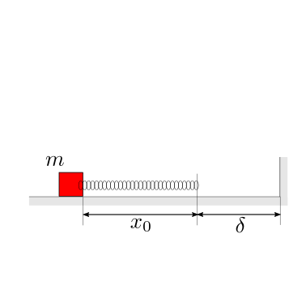
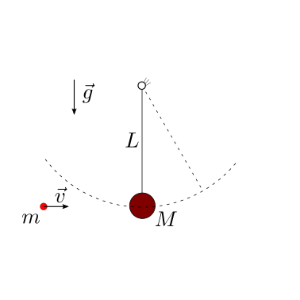

(physics-hs:mechanics:dynamics:collisions)=
# Collisioni

Una descrizione dettagliata delle collisioni tra sistemi qualsiasi va ben al di là dello scopo di un primo approccio alla meccanica.

Qui, ci si limiterà allo studio di collisioni che:
- possono essere caratterizzate unicamente da un *coefficiente di ritorno*, $\varepsilon$ **todo**
- avvengono in intervalli di tempo ridotti, al limite nulli

Questi urti comportano delle variazioni finite delle quantità dinamiche in intervalli di tempo finiti, vengono definiti **urti impulsivi** (**todo** *verificare*) e  rappresentano un esempio di moto "non regolare", per il quale le equazioni cardinali della dinamica devono essere scritte in forma incrementale.

**todo** *approfondimento su forze impulsive e delta di Dirac?*

Tra due istanti temporali immediatamente precedente e immediatamente successivo all'urto tra due sistemi possono essere trascurate tutte le azioni agenti sul sistema complessivo tranne quelle **impulsive** dovute all'**urto**, e ad eventuali **reazioni vincolari** (vedi esercizi),

$$\begin{aligned}
  \vec{I}^{ext}   & = \Delta \vec{Q} \\
  \vec{J}_H^{ext} & = \Delta \vec{\Gamma}_H + \Delta \dot{\vec{x}}_H \times \vec{Q} = \Delta \vec{\Gamma}_{H} \\
  L^{ext} + L^{int} & = \Delta K \ ,
\end{aligned}$$

con $\vec{I}^{ext}$ l'impulso delle forze esterne durante l'urto, $\vec{J}^{ext}$ l'impulso dei momenti esterni durante l'urto, $L^{ext}$, $L^{int}$ il lavoro delle forze esterne e interne durante l'urto.

E' bene osservare che in assenza di forze e momenti impulsivi esterni - anche dovuti a eventuali vincoli - ai due sistemi che collidono, la quantità di moto e il momento della quantità di moto del sistema complessivo si conservano in un urto.
Al contrario, in generale, l'**energia cinetica non si conserva** poiché dipende anche dalla potenza delle azioni interne che includono quelle impulsive scambiate durante l'urto.

Il **coefficiente di restituzione** $\varepsilon \in [0, 1]$ è definito come **todo**


## Problemi

<!-- Esercizio ************************************************************* -->
::::{grid}
:gutter: 2

:::{grid-item-card} Collisione tra blocchi su piano orizzontale liscio
:columns: 8

Date le masse di due blocchi che scivolano su un piano orizzontale liscio, e le velocità iniziali dei due blocchi, e il coefficiente di restituzione dell'urto, viene chiesto di determinare le velocità dei due blocchi dopo l'urto.

:::

:::{grid-item-card} 
:columns: 4


<!-- *Didascalia, se necessaria* -->
:::

::::

```{dropdown} Soluzione.
**todo**
```

<!-- Esercizio ************************************************************* -->
::::{grid}
:gutter: 2

:::{grid-item-card} Collisione tra blocchi su piano orizzontale scabro
:columns: 8

Date le masse di due blocchi che scivolano su un piano orizzontale scabro, le velocità e la distanza iniziale tra i due blocchi, il coefficiente di restituzione dell'urto, il coefficiente di attrito dinamico $\mu^d$ tra i due blocchi e il piano orizzontale, viene chiesto di determinare:
- le condizioni affinché avvenga l'urto
- in caso di urto:
  - le velocità immediatamente dopo l'urto
  - la posizione finale delle due masse

:::

:::{grid-item-card} 
:columns: 4


<!-- *Didascalia, se necessaria* -->
:::

::::

```{dropdown} Soluzione.
**todo**
```

<!-- Esercizio ************************************************************* -->
::::{grid}
:gutter: 2

:::{grid-item-card} Rimbalzo di una palla
:columns: 8

Dato il coefficiente di restituzione degli urti tra la palla di massa $m_1$ nota e ilpiano orizzontale, viene chiesto di determinare la distanza verticale percorsa dalla palla durante i rimbalzi.

**Oss.** Il numero di rimbalzi è infinito, ma il risultato si ottiene da una serie infinita convergente.

:::

:::{grid-item-card} 
:columns: 4


<!-- *Didascalia, se necessaria* -->
:::

::::

```{dropdown} Soluzione.
**todo**
```

<!-- Esercizio ************************************************************* -->
::::{grid}
:gutter: 2

:::{grid-item-card} Collisione di un sistema massa-molla con una parete
:columns: 8

Data la configurazione iniziale del sistema massa-molla, con lunghezza a riposo nulla $\ell_0$ e allungamento iniziale $x_0$, viene chiesto di descrivere l'evoluzione del sistema in funzione del coefficiente di restituzione $\varepsilon$ degli urti tra la massa e la parete rigida verticale. In particolare, si chiede di distinguere il caso di urto elastico dai casi di urto parzialmente elastico.

:::

:::{grid-item-card} 
:columns: 4


<!-- *Didascalia, se necessaria* -->
:::

::::

```{dropdown} Soluzione.
**todo**
```

<!-- Esercizio ************************************************************* -->
::::{grid}
:gutter: 2

:::{grid-item-card} Collisioni tra due blocchi e una parete rigida
:columns: 8

Nel caso di urti perfettamente elastici tra i due blocchi e con la parete, viene chiesto di determinare il numero di urti tra i due blocchi.

:::

:::{grid-item-card} 
:columns: 4


<!-- *Didascalia, se necessaria* -->
:::

::::

```{dropdown} Soluzione.
**todo**
```

<!-- Esercizio ************************************************************* -->
::::{grid}
:gutter: 2

:::{grid-item-card} Proiettile su pendolo con massa concentrata
:columns: 8

Un proiettile colpisce un pendolo. In funzione del coefficiente di restituzione $\varepsilon$, viene chiesto di determinare:
- le condizioni immediatamente successive all'urto
- l'angolo massimo raggiunto dal pendolo

Si calcolino poi le reazioni vincolari a terra, prima, durante e dopo l'urto.

:::

:::{grid-item-card} 
:columns: 4


<!-- *Didascalia, se necessaria* -->
:::

::::

```{dropdown} Soluzione.
**todo**
```

<!-- Esercizio ************************************************************* -->
::::{grid}
:gutter: 2

:::{grid-item-card} Proiettile su pendolo con massa distribuita
:columns: 8

Un proiettile colpisce un pendolo. In funzione del coefficiente di restituzione $\varepsilon$, viene chiesto di determinare:
- le condizioni immediatamente successive all'urto
- l'angolo massimo raggiunto dal pendolo.

Si calcolino poi le reazioni vincolari a terra, prima, durante e dopo l'urto.

:::

:::{grid-item-card} 
:columns: 4


<!-- *Didascalia, se necessaria* -->
:::

::::

```{dropdown} Soluzione.
**todo**
```

<!-- Esercizio ************************************************************* -->
::::{grid}
:gutter: 2

:::{grid-item-card} Proiettile su bersaglio di poligono di tiro
:columns: 8

Un proiettile colpisce il bersaglio di un poligono, inizialmente appoggiato alla parete verticale. In funzione del coefficiente di restituzione $\varepsilon$, viene chiesto di determinare:
- le condizioni immediatamente successive all'urto
- la velocità minima del proiettile prima dell'urto che garantisce di abbattere il bersaglio.

Si calcolino poi le reazioni vincolari a terra, prima, durante e dopo l'urto.

:::

:::{grid-item-card} 
:columns: 4


<!-- *Didascalia, se necessaria* -->
:::

::::

```{dropdown} Soluzione.
**todo**
```

<!-- Esercizio ************************************************************* -->
::::{grid}
:gutter: 2

:::{grid-item-card} Collisione su sistema libero rigido di masse concentrate
:columns: 8

Un proiettile colpisce un sistema rigido di due masse concentrate, libero e inizialmente in quiete. Si chiede di determinare il moto dei sistemi dopo l'urto, in funzione del coefficiente di restituzione.

:::

:::{grid-item-card} 
:columns: 4


<!-- *Didascalia, se necessaria* -->
:::

::::

```{dropdown} Soluzione.
**todo**
```

<!-- Esercizio ************************************************************* -->
::::{grid}
:gutter: 2

:::{grid-item-card} Collisione su sistema libero rigido a massa distribuita
:columns: 8

Un proiettile colpisce un sistema rigido di due masse concentrate, libero e inizialmente in quiete. Si chiede di determinare il moto dei sistemi dopo l'urto, in funzione del coefficiente di restituzione.

:::

:::{grid-item-card} 
:columns: 4


<!-- *Didascalia, se necessaria* -->
:::

::::

```{dropdown} Soluzione.
**todo**
```
