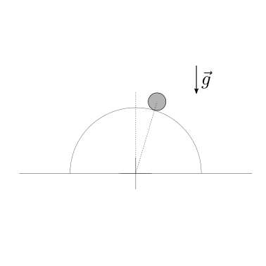

(physics-hs:mechanics:dynamics:problems)=
# Problemi

Questa pagina contiene esercizi di dinamica relativi a diversi argomenti: **moto di un punto materiale**, **moto di sistemi di punti materiali**, **moto di corpi rigidi in due dimensioni**, **urti e collisioni**, **gravitazione**, **equilibrio** e **stabilità**. Alcuni esercizi richiedono l'uso di principi di conservazione.

---

Argomenti: vedi alla fine file. Uncomment
- moto di sistemi di punti
- sistemi estesi con corpi rigidi in 2d
- collisioni
- gravitazione
- equilibrio e stabilità

---

````{only} latex

% Esercizio *****************************************************************
$$
\begin{minipage}[t]{.55\textwidth}
  \vspace{0pt}
  \textbf{Problema 1.}
Una palla di massa $m$ si trova inizialmente in quiete rispetto a un'osservatore inerziale, a una quota $h$ sopra la superficie terrestre.
La palla viene lasciata cadere dalla condizione di quiete. Viene chiesto di determinare:
1. la velocità di impatto con il terreno
2. il tempo impiegato per raggiungere il terreno.

Viene chiesto di svolgere i conti trascurando la resistenza dell'aria. Si chiede poi di:
3. confrontare i risultati ottenuti con i risultati per un corpo di massa $M > m$ 
4. confrontare i risultati ottenuti con i risultati che si otterrebbero nei pressi della superficie lunare.

Raggio Terra: $R_E = 6380 \, km$ ; massa Terra: $M_E = 5.98 \cdot 10^{24} \, kg$;
Raggio Luna:  $R_M = 1740 \, km$ ; massa Luna:  $M_M = 7.34 \cdot 10^{22} \, kg$;
\end{minipage}
\hspace{.05\textwidth}
\begin{minipage}[t]{.40\textwidth}
  \vspace{0pt}
  \includegraphics[width=.95\textwidth]{../../media/dynamics/free-fall.png}
\end{minipage}
$$

**Soluzione.**

**Accelerazione nei pressi della superficie di un pianeta.** L'accelerazione di gravità nei pressi della superficie di un pianeta è data dalla formula **todo** *ref*

$$g = \frac{GM}{R^2} \ .$$

Ricordando il valore della costante di gravitazione universale, $G = 6.67 \cdot 10^{-11} \ \frac{N m^2}{kg^2}$, il campo di accelerazione di gravità nei pressi della superficie di Terra e Luna vale rispettivamente

$$\begin{aligned} 
  g_E & = \frac{G M_E}{R_E^2} = 9.8 \, \frac{m}{s^2} \\
  g_M & = \frac{G M_M}{R_M^2} = 1.6 \, \frac{m}{s^2} \\
\end{aligned}$$

Il rapporto tra le accelerazioni di gravità è $\frac{g_E}{g_M} \sim 6.125$, mentre la radice di questo rapporto - che compare nell'ultimo punto di questo esercizio - è $\sqrt{\frac{g_E}{g_M}} \sim 2.5$.

**1. Velocità di impatto con il terreno.** La velocità di impatto con il terreno può essere ricavata o dalla soluzione delle equazioni del moto, o dalla legge di conservazione dell'energia meccanica per sistemi conservativi: si considera qui il sistema "palla", sul quale agisce la forza di gravità - come manifestazione del campo di gravità del pianeta sui corpi con massa; se:
 - si trascura la resistenza dell'aria - azione non-conservativa, che verrà considerata nel problema successivo -
 - si considera il moto libero, prima dell'impatto a suolo - in generale le collisioni sono non-conservative, ad eccezione dell'unico caso particolare delle collisioni perfettamente elastiche

 sul sistema non agiscono forze non-conservative; in assenza di azioni non-conservative, l'energia meccanica del sistema si conserva.

L'energia meccanica del sistema è la somma dell'energia cinetica e di quella potenziale: poiché solo la gravità agisce sul sistema, nell'energia potenziale compare solo il contributo gravitazionale - nella forma approssimata in prossimità della superficie di un pianeta,

$$E = K + V \ .$$

Se il corpo è in caduta libera senza velocità orizzontale, il moto si svolge lungo la verticale. Il moto può quindi essere descritto con una coordinata sola: qui si sceglie un sistema di coordinate $y$ con origine in corrispondenza del terreno e direzione positiva verso l'alto. L'energia meccanica del sistema può quindi essere scritta come

$$E = \frac{1}{2} m v_y^2 + m g y = \frac{1}{2} m \dot{y}^2 + m g y \ .$$

Nella condizione iniziale "0", il corpo è in quiete quindi la velocità è nulla. Nella condizione "1" poco prima dell'impatto, la quota è nulla rispetto al riferimento. Dall'uguaglianza $E_0 = E_1$ segue

$$\frac{1}{2} m \underbrace{v_y^2}_{=0} + m g h_0 = \frac{1}{2} m v_{y,1}^2 + m g \underbrace{h_1}_{=0} \ ,$$

e quindi 

$$v_{y,1} = \sqrt{2 g h} \ .$$

**2. Caloclo del tempo di volo.** Per il calcolo del tempo di volo è necessario risolvere le equazioni del moto. Il bilancio della quantità di moto lungo $y$,

$$\dot{Q}_y = R^e_y \ ,$$

diventa

$$m \ddot{y} = - m g \ , $$

con le condizioni iniziali $y(0) = h$, $\dot{y}(0) = 0$. Si semplifica la massa del sistema nell'equazione (per $m \ne 0$), e si integra due volte in tempo per risolvere l'equazione differenziale

$$\begin{aligned}
  \dot{y}(t) & = - g t + v_0 \\
       y (t) & = - \frac{1}{2} g t^2 + v_0 t + y_0 \\
\end{aligned}$$

Usando le condizioni iniziali, si trovano i valori delle costanti di integrazione $v_0 = 0$, $y_0 = h$. La legge del moto diventa quindi

$$\begin{aligned}
  \dot{y}(t) & = - g t  \\
       y (t) & = - \frac{1}{2} g t^2 + h \\
\end{aligned}$$

Lo stato del sistema poco prima dell'urto si ottiene imponendo la condizione $y(t_1) = 0$ e quindi si ottiene il tempo di volo (e si ri-ottiene il risultato della velocità di impatto già ottenuto con la conservazione dell'energia, con il segno negativo a indicare la direzione della velocità opposta al verso positivo dell'asse $y$ utilizzato)

$$\begin{aligned}
  t_1 & = \sqrt{\frac{2 h}{g}} \\
  v_1 & = v(t_1) = - g \sqrt{\frac{2 h}{g}} = - \sqrt{2 g h}
\end{aligned}$$

**3. Risultati per un corpo di massa $M > m$.** Nelle ipotesi del problema di trascurare la resistenza aerodinamica del corpo, i risultati ottenuti non contengono la massa $m$ del sistema, e quindi non dipendono da essa.

**4. Risultati nei pressi della superficie lunare.** I risultati nei pressi della superficie lunare si ottengono usando l'accelerazione $g_M$ nelle formule.
Confrontando i tempi e le velocità e usando i valori calcolati a inizio esercizio, si ottiene

$$\begin{aligned}
  \frac{t_{1,M}}{t_{1,E}} & = \sqrt{\frac{g_E}{g_M}} \sim 2.5 \\
  \frac{v_{1,M}}{v_{1,E}} & = \sqrt{\frac{g_M}{g_E}} \sim \frac{1}{2.5} \\
\end{aligned}$$

un tempo di volo sulla Luna che è circa $2.5$ volte quello sulla Terra, e una velocità di impatto circa $\frac{1}{2.5}$ quella sulla Terra. 

% Esercizio *****************************************************************
$$
\begin{minipage}[t]{1.\textwidth}
  \vspace{0pt}
  \textbf{Problema 2.}
Viene chiesto di svolgere l'esercizio precedente, in un ambiente in cui non sia più trascurabile la resistenza aerodinamica del sistema.
In particolare viene chiesto di risolvere il problema nel caso in cui la resistenza aerodinamica sia:
1. proporzionale alla velocità relativa del corpo rispetto al fluido, di intensità $F = c v$, con $c = \dots$
2. proporzionale al quadrato della velocità relativa del corpo rispetto al fluido, di intensità $F = \frac{1}{2} \rho S c_F v^2$, con...

Qui si considera il fluido in quiete rispetto all'ambiente: la velocità del corpo relativa al fluido è quindi uguale alla velocità rispetto all'ambiente.

Viene chiesto poi di determinare la **velocità limite** raggiungibile da un corpo in caduta libera, potendo considerare l'accelerazione di gravità e la densità dell'aria costanti lungo la caduta. 

\end{minipage}
$$

**Soluzione.**

**1. Resistenza aerodinamica $\propto v$.** L'equazione del moto, con condioni iniziali $y(0) = h$, $\dot{y}(0) = 0$, è

$$m \ddot{y} = - c \dot{y} - m g$$

o in termini di velocità

$$m \dot{v} = - c v - m g \ ,$$

che può essere riscritta separando la forzante e mettendo in evidenza l'espressione classica delle equazioni differenziali ordinarie lineari a coefficienti costanti

$$m \dot{v} + c v = - m g \ .$$

La soluzione dell'equazione per la veloctià è la somma della soluzione generale dell'equazione omogenea e di una soluzione particolare,

$$v(t) = A e^{-\frac{c}{m}t} - \frac{mg}{c} \ ,$$

e l'espressione della posizione si ottiene da una seconda integrazione

$$y(t) = - \frac{A m }{c} e^{-\frac{c}{m}t} - \frac{mg}{c}t + B \ .$$

Le condizioni iniziali permettono di ricavare il valore delle costanti di integrazione $A, B$

$$\begin{cases}
  0 & = v(0) = A - \frac{mg}{c} \\
  h & = y(0) = -\frac{Am}{c} + B \\
\end{cases}
\qquad \rightarrow \qquad
\begin{cases}
  A & = \frac{mg}{c} \\
  B & = h + \frac{m^2 g}{c^2} \\
\end{cases}
$$

$$\begin{aligned}
  v_y(t) & = \frac{mg}{c} \left[ e^{-\frac{c}{m}t} - 1 \right] \\
    y(t) & = \frac{m^2 g}{c^2} \left[ 1 - e^{-\frac{c}{m}t} \right] + h - \frac{mg}{c} t
\end{aligned}$$

- La velocità di impatto con il terreno e il tempo di volo si ottengono dalla condizione $y(t_1) = 0$ **todo**
- La velocità limite è la velocità massima (in modulo) che  viene raggiunta per $t \rightarrow +\infty$, e quindi 

   $$v_{y,+\infty} = - \frac{m g}{c} \ .$$

   Si osservi come la velocità limite dipende dalla massa del corpo, e a parità di gravità e resistenza aerodinamica del corpo, un corpo con massa maggiore raggiunge una velocità limite maggiore (in modulo).
...

**Osservazione.** Nel limite di resistenza aerodinamica che tende a zero, e per intervalli di tempo sufficientemente ridotti da avere $\frac{ct}{m}$ "piccolo" (a sufficienza da rendere accettabile questa approssimazione) il termine $e^{-\frac{ct}{m}}$ può essere approssimato come

$$e^{-\frac{ct}{m}} \sim 1 - \frac{ct}{m} + \frac{1}{2} \frac{c^2 t^2}{m^2} \ ,$$

e quindi

$$\begin{aligned}
  v_y(t) & \sim \frac{m g}{c} \left[ -\frac{c}{m} t + \frac{c^2}{2 m^2} t^2 \right] && = - g t + \frac{cg}{2m} t^2 \\
    y(t) & \sim \frac{m^2 g}{c^2} \left[ \frac{c}{m} t - \frac{c^2}{2 m^2} t^2 \right] + h - \frac{mg}{c}t && = - \frac{1}{2} g t^2 + h \\
\end{aligned}$$


**2. Resistenza aerodinamica $\propto v^2$.** 
Per studiare il moto del sistema con resistenza aerodinamica proprozionale al quadrato della velocità conviene usare un sistema di riferimento con origine nella posizione iniziale del sistema e una coordinata con il verso positivo verso il basso. Se inizialmente il corpo è in quiete o ha una velocità verso il basso, il moto non si inverte mai (e la velocità ha sempre lo stesso segno). L'equazione del moto,

$$m \ddot{x} = m g - k |\dot{x}| \dot{x} \ ,$$

con $\dot{x} > 0$ può quindi essere riscritta rimuovendo il valore assoluto. Come fatto in precedenza, prima si scrive l'equazione in funzione della velocità, la si risolve, e successivamente si integra la velocità per trovare lo spazio. Usando la velocità $\dot{x} = v$ come funzione dipendente, l'equazione del moto diventa

$$m \dot{v} = m g - k v^2 \ .$$

La **velocità limite** corrisponde alla condizione in cui la velocità non varia, e quindi la sua derivata è nulla $\overline{v} = \sqrt{\frac{mg}{k}}$. Questa velocità può essere raggiunta da velocità inferiori ad essa (come ad esempio da un corpo che parte da fermo, accelerato dalla gravità), o da velocità superiori ad essa (come ad esempio un proiettile sparato a velocità superiori ad essa, rallentato dalla resistenza aerodinamica). Si può dimostrare **todo** che questa condizione di equilibrio è una condizione stabile: una volta nella condizione limite, un rallentamento del sistema comporterebbe una riduzione (in valore assoluto) della resistenza aerodinamica, e quindi una nuova accelerazione che comprterebbe un aumento della velocità del sistema (in assenza di variazioni di altre condizioni).

Questa equazione differenziale può essere risolta con il metodo di separazione delle variabili, riscrivendola nella forma

$$\frac{d v}{1 - \frac{k}{m g} v^2} = g \, dt \ .$$

Scrivendo la frazione come somma di frazioni,

$$ \frac{1}{2}\left[ \frac{1}{1 - \sqrt{\frac{k}{m g}} v} + \frac{1}{1 + \sqrt{\frac{k}{m g}} v} \right] dv = g \, dt $$

e riconoscendo l'itegrale del logaritmo (ed eliminando il modulo, considerando una velocità iniziale minore della velocità limite $\sqrt{\frac{mg}{k}}$, e quindi sempre minore di essa), dall'integrazione si ricava

$$\frac{1}{2} \sqrt{\frac{mg}{k}} \ln \frac{1 + \sqrt{\frac{k}{mg}} v}{1 - \sqrt{\frac{k}{mg}} v} = g t + C \ ,$$

con la costante di integrazione nulla per la condizione iniziale $v(0) = 0$.

$$\frac{1 + \sqrt{\frac{k}{mg}} v(t)}{1 - \sqrt{\frac{k}{mg}} v(t)} = e^{2 \sqrt{\frac{gk}{m}} t} \ ,$$

e quindi

$$v(t) = \sqrt{\frac{mg}{k}} \frac{1 - e^{-2 \sqrt{\frac{gk}{m}} t}}{1 + e^{-2 \sqrt{\frac{gk}{m}} t}}$$

L'integrazione con le condizioni iniziali del problema fornisce la posizione in funzione del tempo

$$\begin{aligned}
  x(t) - x(0) 
  & = \int_{\tau=0}^t v(\tau) d \tau = \\
  & = \sqrt{\frac{mg}{k}} \int_{\tau=0}^t \frac{1 - e^{-2 \sqrt{\frac{gk}{m}} \tau}}{1 + e^{-2 \sqrt{\frac{gk}{m}} \tau}} \, d \tau = \\
  & = \sqrt{\frac{mg}{k}} \int_{\tau=0}^t \left[ 1 - 2 \frac{e^{-2 \sqrt{\frac{gk}{m}} \tau}}{1 + e^{-2 \sqrt{\frac{gk}{m}} \tau}} \right] d \tau = \\
\end{aligned}$$

Riconoscendo la forma del differenziale di una funzione $e^{-a t}$, $d\left( e^{-a t} \right) = - a e^{-a t} dt$, e quindi di una funzione $c + e^{-at}$ con $c$ costante, $d \left( c + e^{-at} \right) = - a e^{-a t} dt$, gli integrali della forma del secondo possono essere risolti come

$$- \int_{\tau=0}^{t} \frac{e^{-a\tau}}{1+e^{-a\tau}} d\tau = \frac{1}{a} \int_{\tau=0}^{t} \frac{d \left( 1 + e^{-a \tau} \right)}{1+e^{-a \tau}} = \frac{1}{a} \left.\ln \left| 1 + e^{-a \tau} \right| \right|_{0}^{t} = \frac{1}{a} \ln \frac{1 + e^{-a t}}{2} \ .$$

Ricordando la condizione iniziale $x(0) = 0$ quindi la posizione del sistema in funzone del tempo ha l'espressione

$$x(t) = \sqrt{\frac{mg}{k}} \left[ t  + \sqrt{\frac{m}{gk}} \ln \frac{1 + e^{- 2 \sqrt{\frac{gk}{m}} t}}{2}  \right]$$

**Osservazione.** Per piccoli valori della resistenza aerodinamica e intervalli di tempo limitati, si ritrova la soluzione che trascura la resistenza aerodinamica. Infatti

$$f(t) = \ln \left( 1 + e^{-at} \right) = \ln \frac{1 + e^{-2\sqrt{\frac{gk}{m}}t}}{2} = \ln \left( 1 + \frac{e^{-2\sqrt{\frac{gk}{m}}t}-1}{2} \right)$$

può essere scritto nella form $\ln (1+x)$ per "piccoli" $x$ e approssimato con la sua serie di Taylor.

$$\begin{aligned}
         &                                                           && f  (0) = 0             \\
  f' (t) & = \frac{-a e^{-at}}{1 + e^{-at}} = -\frac{a}{1 + e^{at}}  && f' (0) = -\frac{a}{2}  \\
  f''(t) & = \frac{a^2}{\left( 1 + e^{at} \right)^2}                 && f''(0) = \frac{a^2}{4} \\
\end{aligned}$$

$$\begin{aligned}
  x(t) 
  & \sim x(0) + \dot{x}(0) \, t + \frac{\ddot{x}(0}{2} \, t^2  = \\
  & = \sqrt{\frac{mg}{k}} t + \frac{m}{k} \left[ 0 - \sqrt{\frac{gk}{m}} t + \frac{g k}{m} \frac{t^2}{2} \right]
    = \frac{ g \, t^2}{2} \ .
\end{aligned}$$

% Esercizio *****************************************************************
$$
\begin{minipage}[t]{.55\textwidth}
  \vspace{0pt}
  \textbf{Problema 3.}
Un corpo di massa $m$ viene lanciato con velocità iniziale orizzontale con valore assoluto $|\vec{v}_0|$, da una quota $h$ sopra la superficie terrestre. Trascurando la resistenza aerodinamica, viene chiesto di determinare:
1. gittata
2. tempo di volo
3. velocità del corpo all'impatto con il suolo
4. impulso e forza media quando il corpo raggiunge terra, sapendo che il corpo si arresta in un tempo $\Delta t$ lungo una traiettoria rettilinea.

Come ulteriore esercizio, si ripetano i conti senza trascurare la resistenza aerodinamica.
\end{minipage}
\hspace{.05\textwidth}
\begin{minipage}[t]{.40\textwidth}
  \vspace{0pt}
  \includegraphics[width=.95\textwidth]{../../media/dynamics/parabolic-2.png}
\end{minipage}
$$

**Soluzione.**

Gittata e tempo di volo possono essere ricavati dalla soluzione delle equazioni del moto con le opportune condizioni iniziali. Si sceglie di usare un sistema di coordinate cartesiane $x$, $y$ con origine nel punto iniziale, con l'asse $x$ positivo verso destra e l'asse $y$ positivo verso il basso. Usando questo sistema di coordinate, il vettore posizione del punto può essere scritto come

$$\vec{r}_P(t) = x_P(t) \hat{x} + y_P(t) \hat{y} \ .$$

Il bilancio della quantitò di moto del sistema

$$m \ddot{\vec{r}}_P = m \vec{g}$$

con le condizioni iniziali $\vec{r}_P(0) = \vec{0}$, $\dot{\vec{r}}_P(0) = \vec{v}_0 = v_0 \hat{x}$ può essere scritto nelle sue coordinate cartesiane come

$$\begin{cases}
 x: \quad m \ddot{x}_P = 0 \\
 y: \quad m \ddot{y}_P = m g \\
\end{cases}$$

La posizione del corpo può quindi essere espressa in funzione del tempo,

$$\begin{cases}
  x_P(t) = v_{P,x0} t + x_0 \\
  y_P(t) = \frac{1}{2} g t^2 + v_{P,y0} t + y_0 \\
\end{cases}$$

e, con le condizioni iniziali del problema, posizione e velocità (derivata della posizione) del corpo in funzione del tempo $t$ sono

$$
\begin{cases}
  x_P(t) & = v_0 t  \\
  y_P(t) & = \frac{1}{2} g t^2 \\
\end{cases}
\quad , \quad
\begin{cases}
  v_{P,x}(t) & = v_0 \\
  v_{P,y}(t) & = g t \\
\end{cases}
$$


**1. - 2. Gittata e tempo di volo.** La condizione di impatto prevede che il corpo percorra una distanza $h$ in direzione $y$ per raggiungere la superficie orizzonatale, e quindi può essere scritta come

$$y(t_1) = 0 \ .$$

Dalle due componenti cartesiane della posizione segue quindi

$$\begin{cases}
  d = x_{P,1} = v_0 t_1  \\
  h = y_{P,1} = \frac{1}{2} g t_1^2 \ ,
\end{cases}$$

e quindi il tempo di volo $t_1$ e la gittata $d$ sono rispettivamente

$$\begin{aligned}
  t_1 & = \sqrt{\frac{2 h}{g}} \\
  d   & = v_0 \sqrt{\frac{2 h}{g}} \\
\end{aligned}$$

**3. Velocità del corpo all'impatto.** Può essere calcolata usando le equazioni del moto già ricavate, o la conservazione dell'energia meccanica - in assenza di resistenza aerodinamica - come fattto in altri esercizi. Usando le equazioni già ricavate,

$$\vec{v}_1 = \vec{v}(t_1) = v_0 \hat{x} + \sqrt{2 g h } \, \hat{y} \ .$$

**4. Impluso e forza media nell'impatto.** L'impulso delle forze esterne agenti su un corpo equivale alla differenza del momento della quantità di moto **todo** *aggiungere riferimento*

$$\Delta \vec{Q} = \vec{I}^e \ ,$$

e quindi

$$\vec{I}^e = \Delta \vec{Q} = \underbrace{\vec{Q}_2}_{= \vec{0}} - \vec{Q}_1 = - m \vec{v}_1 \ ,$$

poiché la quantità di moto del corpo dopo essersi fermato è nulla, $\vec{Q}_2 = \vec{0}$. L'impulso di una forza è il suo integrale nel tempo,

$$\vec{I} = \int_{t_1}^{t_2} \vec{F}(\tau) \, d \tau \ .$$

Gli istanti di tempo sono separati da $\Delta t$, $t_2 = t_1 + \Delta t$. La definizione di valore medio di una quantità in un intervallo permette di scrivere l'integrale come prodotto dell'intervallo e del valore medio, e quindi

$$\vec{I} = \int_{t_1}^{t_2} \vec{F}(\tau) \, d \tau = \Delta t \, \overline{\vec{F}} \ ,$$

e quindi

$$\vec{F} = \frac{\vec{I}}{\Delta t} = - \frac{m \vec{v}_1}{\Delta t} \ .$$


% Esercizio *****************************************************************
$$
\begin{minipage}[t]{.55\textwidth}
  \vspace{0pt}
  \textbf{Problema 4.}
Viene chiesto di svolgere l'esercizio precedente, in un ambiente in cui non sia più trascurabile la resistenza aerodinamica del sistema.
In particolare viene chiesto di risolvere il problema nel caso in cui la resistenza aerodinamica sia:
1. proporzionale alla velocità relativa del corpo rispetto al fluido, di intensità $F = c v$, con $c = \dots$
2. proporzionale al quadrato della velocità relativa del corpo rispetto al fluido, di intensità $F = \frac{1}{2} \rho S c_F v^2$, con...

Qui si considera il fluido in quiete rispetto all'ambiente: la velocità del corpo relativa al fluido è quindi uguale alla velocità rispetto all'ambiente.

Viene chiesto poi di determinare la **velocità limite** raggiungibile da un corpo in caduta libera, potendo considerare l'accelerazione di gravità e la densità dell'aria costanti lungo la caduta. 

\end{minipage}
\hspace{.05\textwidth}
\begin{minipage}[t]{.40\textwidth}
  \vspace{0pt}
  \includegraphics[width=.95\textwidth]{../../media/dynamics/parabolic-1.png}
\end{minipage}
$$

**Soluzione.**

**1. Gittata massima.** Usando un sistema di coordinate cartesiane (origine, assi,...)

$$\begin{cases}
 m \ddot{x} = 0 \\
 m \ddot{y} = m g \\
\end{cases}$$

con le condizioni iniziali $x(0) = 0$, $y(0) = 0$, $v_x(0) = v_0 \cos \theta$, $v_y(0) = v_0 \sin \theta$

$$\begin{cases}
 x(t; \theta) = v_0 \cos \theta \, t \\
 y(t; \theta) = - \frac{1}{2} g t^2 + v_0 \sin \theta \, t \\
\end{cases}$$

La condizione di impatto (insieme alla condizione di lancio) è $y(t^*) = 0$,

$$0 = -\frac{1}{2} g t^{* 2} + v_0 \sin \theta \, t^* = t^* \left( -\frac{1}{2} g t^* + v_0 \sin \theta \right)$$

ed è soddisfatta agli istanti di tempo $t_0 = 0$ (lancio) e

$$t_1(\theta) = \frac{2 v_0 \sin \theta}{g} \ .$$

Riconoscendo il seno di $2 \theta$, $\sin 2 \theta = 2 \sin \theta \cos \theta $ (**todo** *link alle proprietà delle funzioni trigonometriche*), la gittata diventa

$$d(\theta) = x(t_1;\theta) = v_0 \cos \theta \, t_1(\theta) = 2 \frac{v_0^2}{g} \sin \theta \cos \theta = \frac{v^2_0}{g} \sin 2 \theta \ .$$

Il massimo della gittata si trova per $\sin 2 \theta^* = 1$, e quindi per $\theta^* = \frac{\pi}{4} = 45^\circ$. Il tempo di volo è quindi 

$$t_1^* = \frac{2 v_0 \sin \theta^*}{g} = \sqrt{2} \frac{v_0}{g} \ ,$$

e la quota massima raggiunta (raggiunta per $v_y(t_2) = y'(t_2) = 0$, $t_2 = \frac{v_0}{g} \sin \theta^*$) è

$$y_{max}^* = y\left(t=t_2(\theta^*); \theta^* \right) = -\frac{1}{2} g \frac{v_0^2}{g^2} \sin^2 \theta^* + \frac{v_0^2}{g} \sin^2 \theta^* = 
\frac{1}{2} \frac{v_0^2}{g} \sin^2 \theta^* = \frac{1}{4} \frac{v_0^2}{g} \ .$$


**2. Noto l'impulso.** La relazione tra l'impulso e la differenza di quantità di moto (tra la condizione di quiete, $\vec{v}_{rest} = \vec{0}$ e il moemnto immediatamente successivo al lancio) è

$$\vec{I} = \Delta \vec{Q} = m \vec{v}_0 - m \underbrace{\vec{v}_{rest}}_{= \vec{0}} \ .$$

Noto il legame tra $\vec{I}$ e $\vec{v}_0$, si possono usare i risultati del punto 1. dell'esercizio. Si osservi che dato l'impulso, la velocità $\vec{v}_0$ è inversamente proporzionale alla massa $m$ del sistema che viene accelerato: è infatti più difficile accelerare un corpo pesante rispetto a uno più leggero.

**3. Considerando la resistenza aerodinamica.**

% Esercizio *****************************************************************
$$
\begin{minipage}[t]{.55\textwidth}
  \vspace{0pt}
  \textbf{Problema 5.}
Conoscendo la posizione del punto di lancio $A$, e la posizione del bersaglio $B$ viene chiesto di determinare:
1. le condizioni sulla velocità di lancio per colpire il bersaglio. Una volta determinate, viene chiesto di determinare anche il tempo di volo.
2. tra tutte le velocità ammissibili per colpire il bersaglio, viene chiesto di determinare quella con valore assoluto minimo, sotto al quale non è possibile raggiungere l'obiettivo.

Come ulteriore esercizio, si ripetano i conti senza trascurare la resistenza aerodinamica.

\end{minipage}
\hspace{.05\textwidth}
\begin{minipage}[t]{.40\textwidth}
  \vspace{0pt}
  \includegraphics[width=.95\textwidth]{../../media/dynamics/parabolic-3.png}
\end{minipage}
$$

**Soluzione.**

% Esercizio *****************************************************************
$$
\begin{minipage}[t]{.55\textwidth}
  \vspace{0pt}
  \textbf{Problema 6.}
Conoscendo la posizione del punto di lancio $A$, e la posizione del bersaglio mobile $B: \vec{r}_B(t) = x_B \hat{x} + (y_{B,0} + v_{y,B} t) \hat{y}$ viene chiesto di determinare:
1. le condizioni sulla velocità di lancio per colpire il bersaglio. Una volta determinate, viene chiesto di determinare anche il tempo di volo.
2. tra tutte le velocità ammissibili per colpire il bersaglio, viene chiesto di determinare quella con valore assoluto minimo, sotto al quale non è possibile raggiungere l'obiettivo.

Come ulteriore esercizio, si ripetano i conti senza trascurare la resistenza aerodinamica.

\end{minipage}
\hspace{.05\textwidth}
\begin{minipage}[t]{.40\textwidth}
  \vspace{0pt}
  \includegraphics[width=.95\textwidth]{../../media/dynamics/parabolic-3.png}
\end{minipage}
$$

**Soluzione.**

% Esercizio *****************************************************************
$$
\begin{minipage}[t]{.55\textwidth}
  \vspace{0pt}
  \textbf{Problema 7.}
Un calciatore deve tirare una punizione in porta da una distanza $b$. La barriera viene posta a una distanza $a$ dal punto di tiro e i giocatori in barriera possono coprire fino a una quota $h$ saltando. Volendo centrare la porta a una quota $d$ (compresa tra $0$: la palla tocca terra sulla linea di porta senza rimbalzare prima; e $d_{max}$ la palla finisce all'incrocio), si chiede di determinare:
1. velocità iniziale imposta al pallone dal calcio
2. tempo di volo del pallone tra il calcio e la porta

in tutte le condizioni che permettono di prendere la porta senza colpire la barriera, e senza far rimbalzare il pallone prima della linea della porta. Per ogni valore $d$, si calcoli poi la condizione che corrisponde al tempo minore.

Si trascuri ogni effetto, dovuto alla rotazione del pallone.

Si svolga l'esercizio prima trascurando e poi considerando la resistenza aerodinamica.

**todo** Si può ampliare un po' l'esercizio considerando i tempi di reazione del portiere e la velocità nel comprire le distanze? O formulare qualche metodo per stimare la probabilità di realizzazione di calci di punizione...

\end{minipage}
\hspace{.05\textwidth}
\begin{minipage}[t]{.40\textwidth}
  \vspace{0pt}
  \includegraphics[width=.95\textwidth]{../../media/dynamics/parabolic-4.png}
\end{minipage}
$$

**Soluzione.**

$$\begin{cases}
  x(t) = v_{x0} t \\
  y(t) = -\frac{1}{2} g t^2 + v_{y0} t
\end{cases}$$

La traiettoria è

$$y(x) = - \frac{g}{2 v^2_{x0}} x^2 + \frac{v_{y0}}{v_{x0}} x $$

Chiamando le coordinate $x_1 = b$, $y_1 = d$, il passaggio per il punto si ottiene dalla condizione

$$y_1 = - \frac{g}{2 v^2_{x0}} x_1^2 + \frac{v_{y0}}{v_{x0}} x_1 \ ,$$

con la quale è possibile esprimere la componente $v_{y0}$ in funzione della componente $v_{x0}$ (che rimane così l'unico parametro libero del sistema) e degli altri parametri del sistema

$$v_{y0}(v_{x0}; x_1, y_1) = \frac{y_1}{x_1} \, v_{x0} + \frac{g}{2 v_{x0}} x_1 \ .$$

La condizione che la palla superi la barriera ($x_2 = a$, $y_2 = c$) può essere riscritta come

$$\begin{aligned}
  y_2 < y(x_2)
  & = - \frac{g}{2 v^2_{x0}} x_2^2 + \frac{v_{y0}}{v_{x0}} x_2 = \\
  & = - \frac{g}{2 v^2_{x0}} x_2^2 + x_2  \left[ \frac{y_1}{x_1} + \frac{g}{2 v_{x0}^2} x_1 \right] 
\end{aligned}$$

e quindi

$$\frac{g}{2 v^2_{x0}} x_2 (x_1 - x_2) \ge y_2 - \frac{x_2}{x_1} y_1 \ .$$

In questa disequazione, il termine $x_1 - x_2$ è positivo; il termine $y_2 - \frac{x_2}{x_1} y_1$ può essere positivo o negativo: se negativo, la disequazione è sempre soddisfatta (è negativo nel caso in cui la traiettoria ottenibile con una velocità infinita, al limite, è possibile, cioè quando $\frac{y_2}{x_2} < \frac{y_1}{x_1}$), se positivo, si può scrivere

$$\frac{g}{2}  \frac{x_2(x_1 - x_2)}{y_2 - \frac{x_2}{x_1} y_1} \ge v^2_{x0} \ ,$$

che implica che esiste un valore massimo per $v_{x0}$, che quindi soddisfare la condizione

$$v_{x0} \le \overline{v}_{x0} = \sqrt{\frac{g}{2} \frac{x_1 - x_2}{ \frac{y_2}{x_2} - \frac{y_1}{x_1}}} \ .$$

Il tempo di volo è 

$$t_1 = \frac{x_1}{v_{x0}} \ ,$$

ed è quindi minimo quando $v_{x0}$ è massimo, e quindi quando $v_{x0} = \overline{v}_{x0}$. In questo caso, il rapporto tra la componente verticale e orizzontale della velocità iniziale è

$$\begin{aligned}
  \frac{v_{y0}(\overline{v}_{x0})}{\overline{v}_{x0}}
  & = \frac{y_1}{x_1} + \frac{g x_1}{2 \overline{v}^2_{x0}} = \\
  & = \frac{y_1}{x_1} +  x_1 \frac{g}{2} \frac{2}{g} \frac{\frac{y_2}{x_2} - \frac{y_1}{x_1}}{x_1 - x_2} = \\
  & = \frac{y_1}{x_1} +  x_1 \frac{\frac{y_2}{x_2} - \frac{y_1}{x_1}}{x_1 - x_2} = \\
  & = -\frac{x_2}{x_1 - x_2} \frac{y_1}{x_1} +  \frac{x_1}{x_1-x_2} \frac{y_2}{x_2}  \ .
\end{aligned}$$

**Esempio numerico.** Valutiamo due scelte di tiro per una punizione calciata dai $x_1 = 20 \, m$ con barriera distante $x_2 = 9.15 \, m$ che salta fino a $y_2 = 2.5 \, m$. Si vuole valutare le scelte: A) tiro all'incrocio $y_{1,A} = 2.2 \, m$; B) tiro che si abbassa dopo la barriera fino a $y_{1,B} = 0.2 \, m$.

A. $\overline{v}_{x0} = 18.05 \, m/s $, $\overline{v}_{y0}/\overline{v}_{x0} = 0.411$, $v_{y0} = 7.42 \, m/s $, $|\vec{v}_{0}| = 19.51 \, m/s = 70.2 \, km/h$, $\theta = 22.3^\circ$. $t = 1.11 \, s$

B. $\overline{v}_{x0} = 14.21 \, m/s $, $\overline{v}_{y0}/\overline{v}_{x0} = 0.495$, $v_{y0} = 7.04 \, m/s $, $|\vec{v}_{0}| = 15.86 \, m/s = 57.1 \, km/h$, $\theta = 26.3^\circ$, $t = 1.41 \, s$

% Esercizio *****************************************************************
$$
\begin{minipage}[t]{.55\textwidth}
  \vspace{0pt}
  \textbf{Problema 8.}
Un corpo puntiforme di massa $m$ è vincolato a una guida semi-circolare con un vincolo bilatero ideale (no attrito, solo reazione normale). Il corpo parte in condizioni di quiete da una posizione identificata da un raggio che forma un angolo $\theta_0$ con la verticale. Viene chiesto di:
1. rappresentare il diagramma delle forze agenti sul corpo;
2. scrivere l'espressione dell'energia meccanica del sistema, considerando il centro della semicriconferenza con punto di riferimento per definire l'energia potenziale gravitazionale nulla;
3. determinare la velocità massima del corpo nel suo moto
4. scrivere le equazioni del moto del sistema, usando **se possibile**: a) le equazioni cardinali della dinamica; b) la legge di conservazione dell'energia meccanica, c) altre leggi di conservazioni di quantità meccaniche costanti nella dinamica del sistema
5. determinare le reazioni vincolari della guida sul corpo puntiforme in funzione dell'angolo $\theta$ e daella sua derivata $\dot{\theta}$

\end{minipage}
\hspace{.05\textwidth}
\begin{minipage}[t]{.40\textwidth}
  \vspace{0pt}
  \includegraphics[width=.95\textwidth]{../../media/dynamics/arc-1.png}
\end{minipage}
$$

**Soluzione.**

% Esercizio *****************************************************************
$$
\begin{minipage}[t]{.55\textwidth}
  \vspace{0pt}
  \textbf{Problema 9.}
Un corpo puntiforme di massa $m$ è vincolato a una guida ad arco di cerchio con un vincolo bilatero ideale. Viene lasciato cadere da un angolo $\theta_0$ in condizioni di quiete. L'angolo "di uscita" della guida è $\theta_1$. Se ragginge l'angolo di uscita, il corpo è libero di compiere la traiettoria caratteristica del moto libero nella prossimità della superficie terrestre. Viene chiesto di determinare:
1. la velocità massima del corpo lungo la guida,
2. le condizioni per venire lanciato fuori dalla guida
3. la traiettoria del moto libero, determinando in particolare la gittata, il tempo di volo e la velocità di impatto.
4. sapendo che all'impatto il corpo viene rallentato dal terreno lungo una traiettoria rettilinea con una decelerazione costante $a$, si chiede di tereminare il tempo necessario all'arresto (a partire dall'impatto), l'impulso e la forza media.

Viene chiesto di discutere il problema considerando un attrito dinamico con coefficiente di attrito $\mu_d$ tra la guida e il corpo, rappresentando il diagramma delle forze agenti sul corpo e determinando le equazioni del moto lungo la guida. 

\end{minipage}
\hspace{.05\textwidth}
\begin{minipage}[t]{.40\textwidth}
  \vspace{0pt}
  \includegraphics[width=.95\textwidth]{../../media/dynamics/arc-2.png}
\end{minipage}
$$

**Soluzione.**

% Esercizio *****************************************************************
$$
\begin{minipage}[t]{.55\textwidth}
  \vspace{0pt}
  \textbf{Problema 10.}
Una guida è formata da un primo tratto di raggio $R_1$, un secondo tratto di una circonferenza completa di raggio $R_2 < R_1$ e un terzo tratto rettilineo orizzontale. Trascurando l'attrito nei primi due tratti, viene chiesto di determinare:
1. le condizioni necessarie per poter compiere il loop del secondo tratto, nel caso di vincolo bilatero
2. le condizioni necessarie per poter compiere il loop del secondo tratto, nel caso di vincolo monolatero
3. la distanza percorsa sul terzo tratto orizzontale, sul quale non è possibile trascurare l'attrito con la guida, rappresentabile con la formula dell'attrito dinamico con coefficiente $\mu_d$.

Come esercizio aggiuntivo, viene chiesto di discutere il problema del moto del corpo con vincolo monolatero, nel caso in cui non sia in grado di compiere il loop.

\end{minipage}
\hspace{.05\textwidth}
\begin{minipage}[t]{.40\textwidth}
  \vspace{0pt}
  \includegraphics[width=.95\textwidth]{../../media/dynamics/arc-3.png}
\end{minipage}
$$

**Soluzione.**

% Esercizio *****************************************************************
$$
\begin{minipage}[t]{.55\textwidth}
  \vspace{0pt}
  \textbf{Problema 11.}
Conoscendo la configurazione iniziale della massa $m$, viene chiesto di descrivere la dinamica del sistema nel caso di attrito nullo e nel caso di attrito non trascurabile. Viene chiesto di:
1. determinare le equazioni del moto
2. risolvere le equazioni del moto
3. determinare le reazioni vincolari scambiate tra massa e parete obliqua
4. determinare la forza scambiata tra molla e parete, in funzione del tempo

\end{minipage}
\hspace{.05\textwidth}
\begin{minipage}[t]{.40\textwidth}
  \vspace{0pt}
  \includegraphics[width=.95\textwidth]{../../media/dynamics/oscillator-1.png}
\end{minipage}
$$

**Soluzione.**

% Esercizio *****************************************************************
$$
\begin{minipage}[t]{.55\textwidth}
  \vspace{0pt}
  \textbf{Problema 12.}
  Testo
\end{minipage}
\hspace{.05\textwidth}
\begin{minipage}[t]{.40\textwidth}
  \vspace{0pt}
  \includegraphics[width=.95\textwidth]{../../media/dynamics/oscillator-2-hinge.png}
\end{minipage}
$$

**Soluzione.**

% Esercizio *****************************************************************
$$
\begin{minipage}[t]{.55\textwidth}
  \vspace{0pt}
  \textbf{Problema 13.}
  Testo
\end{minipage}
\hspace{.05\textwidth}
\begin{minipage}[t]{.40\textwidth}
  \vspace{0pt}
  \includegraphics[width=.95\textwidth]{../../media/dynamics/oscillator-2-cart.png}
\end{minipage}
$$

**Soluzione.**

% Esercizio *****************************************************************
$$
\begin{minipage}[t]{.55\textwidth}
  \vspace{0pt}
  \textbf{Problema 14.}
  Testo
\end{minipage}
\hspace{.05\textwidth}
\begin{minipage}[t]{.40\textwidth}
  \vspace{0pt}
  \includegraphics[width=.95\textwidth]{../../media/dynamics/oscillator-3-hinge.png}
\end{minipage}
$$

**Soluzione.**

% Esercizio *****************************************************************
$$
\begin{minipage}[t]{.55\textwidth}
  \vspace{0pt}
  \textbf{Problema 15.}
  Testo
\end{minipage}
\hspace{.05\textwidth}
\begin{minipage}[t]{.40\textwidth}
  \vspace{0pt}
  \includegraphics[width=.95\textwidth]{../../media/dynamics/oscillator-3-cart.png}
\end{minipage}
$$

**Soluzione.**

% Esercizio *****************************************************************
$$
\begin{minipage}[t]{.55\textwidth}
  \vspace{0pt}
  \textbf{Problema 16.}
  Testo
\end{minipage}
\hspace{.05\textwidth}
\begin{minipage}[t]{.40\textwidth}
  \vspace{0pt}
  \includegraphics[width=.95\textwidth]{../../media/dynamics/oscillator-3-cart-hinge-rod.png}
\end{minipage}
$$

**Soluzione.**

% Esercizio *****************************************************************
$$
\begin{minipage}[t]{.55\textwidth}
  \vspace{0pt}
  \textbf{Problema 17.}
  Testo
\end{minipage}
\hspace{.05\textwidth}
\begin{minipage}[t]{.40\textwidth}
  \vspace{0pt}
  \includegraphics[width=.95\textwidth]{../../media/dynamics/oscillator-4-spring-hinge.png}
\end{minipage}
$$

**Soluzione.**

% Esercizio *****************************************************************
$$
\begin{minipage}[t]{.55\textwidth}
  \vspace{0pt}
  \textbf{Problema 18.}
  Testo
\end{minipage}
\hspace{.05\textwidth}
\begin{minipage}[t]{.40\textwidth}
  \vspace{0pt}
  \includegraphics[width=.95\textwidth]{../../media/dynamics/oscillator-4-spring-cart.png}
\end{minipage}
$$

**Soluzione.**

% Esercizio *****************************************************************
$$
\begin{minipage}[t]{.55\textwidth}
  \vspace{0pt}
  \textbf{Problema 19.}
  Testo
\end{minipage}
\hspace{.05\textwidth}
\begin{minipage}[t]{.40\textwidth}
  \vspace{0pt}
  \includegraphics[width=.95\textwidth]{../../media/dynamics/oscillator-5-oscillator-point.png}
\end{minipage}
$$

**Soluzione.**

**Leggi di conservazione.** In assenza di attrito tra il solido inferiore e la parete orizzontale, sul sistema formato dai due solidi collegati dalla molla non agiscono forze esterne in direzione orizzontale: è conservata quindi la **componente orizzontale della quantità di moto del sistema**.
In assenza di attrito, sul sistema non agiscono azioni non conservative (gravità è conservativa, molla ideale è conservativa, e la reazione del vincolo non compie lavoro in assenza di attrito): è conservata quindi l'**energia meccanica del sistema**. 

**Scelta dei gradi di libertà.** Sia $x$ la posizione relativa della solido 2 rispetto al solido 1, coincidente con l'allungamento della molla; sia $y$ la posizione del solido 1 rispetto all'osservatore inerziale.

1. L'energia meccanica del sistema è data dalla somma della sua energia cinetica e dalla sua energia potenziale, qui dovuta solo alla molla (i baricentri dei corpi non cambiano quota, quindi l'azione gravitazionale non compie lavoro). In un momento generico, quindi

   $$E = K + V = \frac{1}{2} m_1 \dot{y}^2 + \frac{1}{2} m_2 \left( \dot{x} + \dot{y} \right)^2 + \frac{1}{2} k x^2 \ .$$

   e poiché il sistema è inizialmente in uno stato di quiete, l'energia meccanica vale $E = E_{0} = \frac{1}{2} k x_0^2$.

   La quantità di moto del sistema è data dalla somma delle quantità di moto delle sue parti. La componente orizzontale è quindi

   $$Q_x = m_1 \dot{y} + m_2 \left( \dot{x} + \dot{y} \right) \ ,$$

   e poiché il sistema è inizialmente in uno stato di quiete, la componente orizzontale della quantità di moto vale $Q_x = 0$. Da questa relazione si può quindi ricavare una relazione tra le derivate dei due gradi di libertà,

   $$\dot{x} = - \frac{m_1 + m_2}{m_2} \dot{y}$$ (mechanics:ex19:kinematics)

2. Usando la relazione {eq}`mechanics:ex19:kinematics`, è possibile riscrivere l'espressione dell'energia meccanica del sistema in funzione solo di $x$ e $\dot{y}$

    $$E_0 = m_1 \dot{y}^2 + \frac{1}{2} k x^2 \ .$$

    Quindi la velocità massima dei due corpi si verifica quando l'allungamento della molla è nullo, $x = 0$,

    $$\begin{aligned}
       |v_{1,max}| & = |\dot{y}|_{max}         && = \sqrt{\frac{E_0}{m_1}} \\
       |v_{2,max}| & = |\dot{x}+\dot{y}|_{max} && = \frac{m_1}{m_2}\sqrt{\frac{E_0}{m_1}} \\
    \end{aligned}$$

3. Le equazioni dinamiche del moto possono essere ottenute ad esempio:
   - dalle equazioni del moto, come il bilancio della quantità di moto della massa 2, e il bilancio della quantità di moto del sistema composto dalle due masse

      $$\begin{cases}
         m_2 (\ddot{x} + \ddot{y}) + k x = 0 \\
         m_1 \ddot{y} + m_2 (\ddot{x} + \ddot{y}) = 0
      \end{cases}$$

   - oppure, derivando le espressioni dell'energia meccanica e della componente orizzontale della quantità di moto (integrali del moto)

   Ad esempio, calcolando le derivate degli integrali del moto,

   $$\begin{cases}
     0 = \dot{y} m_1 \ddot{y} + m_2 (\dot{x} + \dot{y}) (\ddot{x} + \ddot{y}) + k x \dot{x} \\
     0 = m_1 \ddot{y} + m_2 ( \ddot{x} + \ddot{y} ) = 0
    \end{cases}$$

    e usando la relazione {eq}`mechanics:ex19:kinematics` per esprimere $\dot{x}$ in funzione di $\dot{y}$ e semplificare questo ultimo termine nella prima delle due equazioni,

    $$\begin{aligned}
      0 & = \dot{y} \left[ m_1 \ddot{y} + m_2 \left( - \frac{m_1+m_2}{m_2} + 1\right) \left( \ddot{x} + \ddot{y} \right) - \frac{m_1 + m_2}{m_2} k x \right] = \\
        & = \dot{y} \left[ m_1 \ddot{y} - m_1 (\ddot{x} + \ddot{y}) - \frac{m_1 + m_2}{m_2} k x \right]
    \end{aligned}$$

    e quindi

    $$\begin{cases}
      0 = m_1 \ddot{x} + \frac{m_1 + m_2}{m_2} k x \\
      0 = m_1 \ddot{y} + m_2 ( \ddot{x} + \ddot{y} ) = 0
    \end{cases}$$

    **Osservazione.** Queste equazioni sono equivalenti a quelle trovate in precedenza con le equazioni del moto, poiché 

    $$m_2 (\ddot{x} + \ddot{y}) = m_2 \ddot{x} \left( 1 - \frac{m_2}{m_1 + m_2} \right) = m_2 \frac{m_1}{m_1 + m_2} \ddot{x} \ .$$


% Esercizio *****************************************************************
$$
\begin{minipage}[t]{.55\textwidth}
  \vspace{0pt}
  \textbf{Problema 20.}
  Testo
\end{minipage}
\hspace{.05\textwidth}
\begin{minipage}[t]{.40\textwidth}
  \vspace{0pt}
  \includegraphics[width=.95\textwidth]{../../media/dynamics/oscillator-5-oscillator-disk.png}
\end{minipage}
$$

**Soluzione.**

% Esercizio *****************************************************************
$$
\begin{minipage}[t]{.55\textwidth}
  \vspace{0pt}
  \textbf{Problema 21.}
  Testo
\end{minipage}
\hspace{.05\textwidth}
\begin{minipage}[t]{.40\textwidth}
  \vspace{0pt}
  \includegraphics[width=.95\textwidth]{../../media/dynamics/oscillator-5-oscillator-prism-point.png}
\end{minipage}
$$

**Soluzione.**

% Esercizio *****************************************************************
$$
\begin{minipage}[t]{.55\textwidth}
  \vspace{0pt}
  \textbf{Problema 22.}
  Testo
\end{minipage}
\hspace{.05\textwidth}
\begin{minipage}[t]{.40\textwidth}
  \vspace{0pt}
  \includegraphics[width=.95\textwidth]{../../media/dynamics/oscillator-5-oscillator-prism-disk.png}
\end{minipage}
$$

**Soluzione.**

% Esercizio *****************************************************************
$$
\begin{minipage}[t]{.55\textwidth}
  \vspace{0pt}
  \textbf{Problema 23.}
  Testo
\end{minipage}
\hspace{.05\textwidth}
\begin{minipage}[t]{.40\textwidth}
  \vspace{0pt}
  \includegraphics[width=.95\textwidth]{../../media/dynamics/ramp-6.png}
\end{minipage}
$$

**Soluzione.**

% Esercizio *****************************************************************
$$
\begin{minipage}[t]{.55\textwidth}
  \vspace{0pt}
  \textbf{Problema 24.}
  Testo
\end{minipage}
\hspace{.05\textwidth}
\begin{minipage}[t]{.40\textwidth}
  \vspace{0pt}
  \includegraphics[width=.95\textwidth]{../../media/dynamics/ramp-6-moving.png}
\end{minipage}
$$

**Soluzione.**

% Esercizio *****************************************************************
$$
\begin{minipage}[t]{.55\textwidth}
  \vspace{0pt}
  \textbf{Problema 25.}
A un disco di massa $M$ e raggio $R$ e distribuzione di massa uniforme è connessa una massa concentrata $m$ che può essere rappresentata da una massa puntiforme, posizionata a distanza $R$ dal centro del disco. Il sistema inizialmente in quiete viene messo in moto da una coppia costante $C$ fino a raggiungere la velocità angolare di regime $\Omega$. Viene chiesto di determinare:
1. il momento di inerzia del sistema rispetto al centro di rotazione
2. il tempo necessario per raggiungere la velocità angolare $\Omega$
3. le reazioni vincolari in corrispondenza della cerniera

**todo** Commentare i risultati di questo esercizio con la [resistenza a fatica dei materiali](continuum:solids:fatigue)

\end{minipage}
\hspace{.05\textwidth}
\begin{minipage}[t]{.40\textwidth}
  \vspace{0pt}
  \includegraphics[width=.95\textwidth]{../../media/dynamics/eccentric-6-0.png}
\end{minipage}
$$

**Soluzione.**
1. Il momento di inerzia del sistema rispetto al centro di rotazione è uguale alla somma dei momenti di inerzia del disco e della massa concentrata, **todo** *perché? Il momento angolare è una quantità additiva, ma il momento di inerzia?* **todo** *fare riferimento ai valori dei momenti di inerzia di disco e massa*

   $$I = I^{disk} + I^{mass} = \frac{1}{2} M R^2 + m R^2 \ .$$

2. L'equazione di moto che governa la dinamica dell'angolo di rotazione del sistema $\theta(t)$ può essere ricavata dall'equazione di bilancio del momento della quantità di moto, usando come polo $A$ il centro del cerchio (polo fisso, $\dot{\vec{x}}_A = \vec{0}$)

   $$\frac{d L_A}{d t} = M^{ext}_A \ .$$

   Il momento della quantità di moto è la somma dei momenti della quantità di moto dei due sistemi. La sua componente perpendicolare al piano di rotazione vale

   $$L_{A,z} = L_{A,z}^{disk} + L_{A,z}^{mass} = I^{disk} \dot{\theta} + m R^2 \dot{\theta} = I \dot{\theta} \ .$$
   
   L'equazione del moto quindi diventa

   $$I \ddot{\theta} = C \ ,$$

   dove la derivata del momento angolare uguaglia la coppia esterna agente sul sistema. Se il sistema parte da una condizione di quiete e la coppia applicata è costante, è possibile integrare l'equazione del moto e trovare

   $$\begin{aligned}
     \dot{\theta}(t) & = \frac{C}{I} \, t \\
          \theta (t) & = \frac{1}{2} \frac{C}{I} \, t^2 \\
   \end{aligned}$$

   fino al raggiungimento della velocità di regime $\Omega = \dot{\theta}(t^*) = \dfrac{C t^*}{I}$, nell'intervallo di tempo

   $$t^* = \frac{I \Omega}{C} \ .$$

3. Una cerniera cilindrica permette la rotazione del corpo attorno al proprio asse, mentre vincola completamente la traslazione del punto in cui viene connessa, con una forza come reazione vincolare. In un moto piano, la cerniera impedisce la traslazione in due direzioni e la reazione vincolare è una forza che viene determinata dalle sue due componenti nel piano.

    Una volta noto il moto del sistema, $\theta(t)$, le reazioni vincolari possono essere determinate ad esempio dall'equazione di bilancio della quantità di moto del sistema,

    $$\dot{\vec{Q}} = \vec{R} \ .$$

    La quantità di moto del sistema è uguale alla somma delle quantità di moto delle sue parti. Il centro di massa del disco non trasla, e quindi la quantità di moto del disco è nulla. Usando un sistema di coordinate polari, si può scrivere la quantità di moto del sistema come

    $$\vec{Q} = m \vec{v}_B = m R \dot{\theta} \hat{\theta} \ ,$$

    e la sua derivata,

    $$\dot{\vec{Q}} = m R \ddot{\theta} \hat{\theta} - m R \dot{\theta}^2 \hat{r} \ .$$

    Dal bilancio della quantità di moto del sistema, si ottengono le azioni imposte dal vincolo sul sistema (quelle che agiscono sul vincolo sono uguali e contrarie, per il principio di azione/reazione),

    $$\vec{R} = R_r \hat{r} + R_{\theta} \hat{\theta} = \dot{\vec{Q}} = m R \ddot{\theta} \, \hat{\theta} - m R \dot{\theta}^2 \, \hat{r} \ .$$

% Esercizio *****************************************************************
$$
\begin{minipage}[t]{.55\textwidth}
  \vspace{0pt}
  \textbf{Problema 26.}
  Testo
\end{minipage}
\hspace{.05\textwidth}
\begin{minipage}[t]{.40\textwidth}
  \vspace{0pt}
  \includegraphics[width=.95\textwidth]{../../media/dynamics/eccentric-6-1.png}
\end{minipage}
$$

**Soluzione.**

% Esercizio *****************************************************************
$$
\begin{minipage}[t]{.55\textwidth}
  \vspace{0pt}
  \textbf{Problema 27.}
  Testo
\end{minipage}
\hspace{.05\textwidth}
\begin{minipage}[t]{.40\textwidth}
  \vspace{0pt}
  \includegraphics[width=.95\textwidth]{../../media/dynamics/eccentric-6-2.png}
\end{minipage}
$$

**Soluzione.**

% Esercizio *****************************************************************
$$
\begin{minipage}[t]{.55\textwidth}
  \vspace{0pt}
  \textbf{Problema 28.}
Un sistema puntiforme è libero di scivolare su una superficie semi-circolare con attrito trascurabile. Conoscendo la condizione iniziale, $\theta(0) = \theta_0$, $\dot{\theta}(0) = \Omega$, viene chiesto di determinare:
1. la condizione di distacco dalla superficie
2. la distanza di orizzontale del punto di atterraggio del corpo dopo il volo libero, rispetto alla superficie semicircolare.

\end{minipage}
\hspace{.05\textwidth}
\begin{minipage}[t]{.40\textwidth}
  \vspace{0pt}
  \includegraphics[width=.95\textwidth]{../../media/dynamics/detach-7-point.png}
\end{minipage}
$$

**Soluzione.**

Il vincolo con la superficie è un vincolo ideale monolatero, che agisce solo fino a quando la componente radiale della reazione vincolare è positiva. Fino a quando il vincolo ideale monolatero è attivo - cioè fino a quando la massa scivola sulla superficie - il sistema ha un grado di libertà, qui scelto come l'angolo $\theta$. Il distacco del corpo dalla superficie vine determinata dalla condizione $R_r(\theta^*) = 0$. Successivamente al distacco, il sistema ha due gradi di libertà mentre compie un moto libero in un campo gravitazionale.

1. L'equazione di bilancio del momento della quantità di moto rispetto al centro della circonferenza permette di determinare un'equazione pura del moto del sistema

    $$\frac{d L_{A,z}}{d t} = M_{A,z}^{ext} \ ,$$

    e quindi

    $$m R^2 \ddot{\theta} = m g R \sin \theta$$

    con le condizioni iniziali definite dal problema. Oppure, la conservazione dell'energia meccanica

    $$E = m g R \cos \theta + \frac{1}{2} m R^2 \dot{\theta}^2$$ (mechanics:ex28:energy)

    in assenza di azioni non conservative, permette di ricavare immediatamente una relazione tra $\theta$ e $\dot{\theta}$.
    L'equazione di bilancio della quantità di moto permette invece di determinare le reazioni vincolari,

    $$\dot{\vec{Q}} = \vec{R}^e \ ,$$

    $$\begin{aligned}
      R_r \hat{r} + \underbrace{R_{\theta}}_{= 0 \text{ no friction}} \hat{\theta} + m \vec{g} 
      & = \dfrac{d}{dt} \left( m R \dot{\theta} \hat{\theta} \right) = \\
      & = m R \left( \ddot{\theta} \hat{\theta} - \dot{\theta}^2 \hat{r} \right)
    \end{aligned}$$

    e quindi le due componenti radiale e tangenziale diventano

    $$\begin{cases}
       r:      \ R_r = m g \cos \theta - m R \dot{\theta}^2 \\
       \theta: \ m g \sin \theta = m R \ddot{\theta}^2 \\
    \end{cases}$$

    La componente tangenziale è equivalente all'equazione pura del moto; la componente radiale fornisce l'espressione della reazione vincolare in funzione di $\theta$ e $\dot{\theta}$. Usando la relazione {eq}`mechanics:ex28:energy` per esprimere $\dot{\theta}$ in funzione di $\theta$, si può scrivere la reazione normale in funzione del solo $\theta$

    $$\begin{aligned}
      R_r
      & = m g \cos \theta - m R \dot{\theta}^2 = \\
      & = m g \cos \theta - \frac{2}{R} \left( E - m g R \cos \theta \right) = \\
      & = 3 m g \cos \theta - \frac{2 E}{R} \ . 
    \end{aligned}$$

    La condizione $R_r \ge 0$ equivale quindi alla condizione

    $$\cos \theta \ge \frac{2}{3} \frac{E}{m g R}$$

2. Nel caso in cui il sistema è inizialmente in corrispondenza del punto più alto della superficie e in quiete (o quel minimo di velocità per allontanarsi dalla posizione di equilibrio instabile), l'energia meccanica del sistema è $E = m g R$ e l'angolo limite $\theta^*$ ha coseno e seno

    $$\begin{aligned}
      \cos \theta^* & = \frac{2}{3} \frac{E}{mgR} = \frac{2}{3} \\
      \sin \theta^* & = \sqrt{1 - \cos^2 \theta^* } = \frac{\sqrt{5}}{3} \\
    \end{aligned}$$

    e la sua derivata vale

    $$\begin{aligned}
      \dot{\theta}^*
      & = \sqrt{ \frac{2}{m R^2} \left( E - m g R \cos \theta^* \right) } = \\
      & = \sqrt{ \frac{2}{m R^2} \left( m g R - m g R \frac{2}{3} \right) } 
        = \sqrt{ \frac{2}{3} \frac{g}{R} } \ .
    \end{aligned}$$
 
    Il moto libero è determinato dalle equazioni del moto

    $$\begin{cases}
      m \ddot{x} = 0 \\
      m \ddot{y} = -m g \\
    \end{cases}$$

    con le condizioni iniziali

    $$
    \begin{cases} x(t_0) = R \sin \theta^* \\ y(t_0) = R \cos \theta^* \end{cases} 
    \quad , \quad 
    \begin{cases} v_x(t_0) = R \dot{\theta}^* \sin \theta^* \\ v_y(t_0) = - R \dot{\theta}^* \cos \theta^* \end{cases}
    $$


% Esercizio *****************************************************************
$$
\begin{minipage}[t]{.55\textwidth}
  \vspace{0pt}
  \textbf{Problema 29.}
  Testo
\end{minipage}
\hspace{.05\textwidth}
\begin{minipage}[t]{.40\textwidth}
  \vspace{0pt}
  \includegraphics[width=.95\textwidth]{../../media/dynamics/detach-7-disk.png}
\end{minipage}
$$

**Soluzione.**

% Esercizio *****************************************************************
$$
\begin{minipage}[t]{.55\textwidth}
  \vspace{0pt}
  \textbf{Problema 30.}
  Testo
\end{minipage}
\hspace{.05\textwidth}
\begin{minipage}[t]{.40\textwidth}
  \vspace{0pt}
  \includegraphics[width=.95\textwidth]{../../media/dynamics/oscillator-8-ring-disk.png}
\end{minipage}
$$

**Soluzione.**

% Esercizio *****************************************************************
$$
\begin{minipage}[t]{.55\textwidth}
  \vspace{0pt}
  \textbf{Problema 31.}
  Testo
\end{minipage}
\hspace{.05\textwidth}
\begin{minipage}[t]{.40\textwidth}
  \vspace{0pt}
  \includegraphics[width=.95\textwidth]{../../media/dynamics/oscillator-8-ring-half-disk.png}
\end{minipage}
$$

**Soluzione.**

````

````{only} html

<!-- Esercizio ************************************************************* -->
::::{grid}
:gutter: 2

:::{grid-item-card} Problema 1. Caduta libera
:columns: 8

Una palla di massa $m$ si trova inizialmente in quiete rispetto a un'osservatore inerziale, a una quota $h$ sopra la superficie terrestre.
La palla viene lasciata cadere dalla condizione di quiete. Viene chiesto di determinare:
1. la velocità di impatto con il terreno
2. il tempo impiegato per raggiungere il terreno.

Viene chiesto di svolgere i conti trascurando la resistenza dell'aria. Si chiede poi di:

3. confrontare i risultati ottenuti con i risultati per un corpo di massa $M > m$ 
4. confrontare i risultati ottenuti con i risultati che si otterrebbero nei pressi della superficie lunare.

Raggio Terra: $R_E = 6380 \, km$ ; massa Terra: $M_E = 5.98 \cdot 10^{24} \, kg$;
Raggio Luna:  $R_M = 1740 \, km$ ; massa Luna:  $M_M = 7.34 \cdot 10^{22} \, kg$;

:::

:::{grid-item-card} 
:columns: 4


<!-- *Didascalia, se necessaria* -->
:::

::::

```{dropdown} Soluzione.
**Accelerazione nei pressi della superficie di un pianeta.** L'accelerazione di gravità nei pressi della superficie di un pianeta è data dalla formula **todo** *ref*

$$g = \frac{GM}{R^2} \ .$$

Ricordando il valore della costante di gravitazione universale, $G = 6.67 \cdot 10^{-11} \ \frac{N m^2}{kg^2}$, il campo di accelerazione di gravità nei pressi della superficie di Terra e Luna vale rispettivamente

$$\begin{aligned} 
  g_E & = \frac{G M_E}{R_E^2} = 9.8 \, \frac{m}{s^2} \\
  g_M & = \frac{G M_M}{R_M^2} = 1.6 \, \frac{m}{s^2} \\
\end{aligned}$$

Il rapporto tra le accelerazioni di gravità è $\frac{g_E}{g_M} \sim 6.125$, mentre la radice di questo rapporto - che compare nell'ultimo punto di questo esercizio - è $\sqrt{\frac{g_E}{g_M}} \sim 2.5$.

**1. Velocità di impatto con il terreno.** La velocità di impatto con il terreno può essere ricavata o dalla soluzione delle equazioni del moto, o dalla legge di conservazione dell'energia meccanica per sistemi conservativi: si considera qui il sistema "palla", sul quale agisce la forza di gravità - come manifestazione del campo di gravità del pianeta sui corpi con massa; se:
 - si trascura la resistenza dell'aria - azione non-conservativa, che verrà considerata nel problema successivo -
 - si considera il moto libero, prima dell'impatto a suolo - in generale le collisioni sono non-conservative, ad eccezione dell'unico caso particolare delle collisioni perfettamente elastiche

 sul sistema non agiscono forze non-conservative; in assenza di azioni non-conservative, l'energia meccanica del sistema si conserva.

L'energia meccanica del sistema è la somma dell'energia cinetica e di quella potenziale: poiché solo la gravità agisce sul sistema, nell'energia potenziale compare solo il contributo gravitazionale - nella forma approssimata in prossimità della superficie di un pianeta,

$$E = K + V \ .$$

Se il corpo è in caduta libera senza velocità orizzontale, il moto si svolge lungo la verticale. Il moto può quindi essere descritto con una coordinata sola: qui si sceglie un sistema di coordinate $y$ con origine in corrispondenza del terreno e direzione positiva verso l'alto. L'energia meccanica del sistema può quindi essere scritta come

$$E = \frac{1}{2} m v_y^2 + m g y = \frac{1}{2} m \dot{y}^2 + m g y \ .$$

Nella condizione iniziale "0", il corpo è in quiete quindi la velocità è nulla. Nella condizione "1" poco prima dell'impatto, la quota è nulla rispetto al riferimento. Dall'uguaglianza $E_0 = E_1$ segue

$$\frac{1}{2} m \underbrace{v_y^2}_{=0} + m g h_0 = \frac{1}{2} m v_{y,1}^2 + m g \underbrace{h_1}_{=0} \ ,$$

e quindi 

$$v_{y,1} = \sqrt{2 g h} \ .$$

**2. Caloclo del tempo di volo.** Per il calcolo del tempo di volo è necessario risolvere le equazioni del moto. Il bilancio della quantità di moto lungo $y$,

$$\dot{Q}_y = R^e_y \ ,$$

diventa

$$m \ddot{y} = - m g \ , $$

con le condizioni iniziali $y(0) = h$, $\dot{y}(0) = 0$. Si semplifica la massa del sistema nell'equazione (per $m \ne 0$), e si integra due volte in tempo per risolvere l'equazione differenziale

$$\begin{aligned}
  \dot{y}(t) & = - g t + v_0 \\
       y (t) & = - \frac{1}{2} g t^2 + v_0 t + y_0 \\
\end{aligned}$$

Usando le condizioni iniziali, si trovano i valori delle costanti di integrazione $v_0 = 0$, $y_0 = h$. La legge del moto diventa quindi

$$\begin{aligned}
  \dot{y}(t) & = - g t  \\
       y (t) & = - \frac{1}{2} g t^2 + h \\
\end{aligned}$$

Lo stato del sistema poco prima dell'urto si ottiene imponendo la condizione $y(t_1) = 0$ e quindi si ottiene il tempo di volo (e si ri-ottiene il risultato della velocità di impatto già ottenuto con la conservazione dell'energia, con il segno negativo a indicare la direzione della velocità opposta al verso positivo dell'asse $y$ utilizzato)

$$\begin{aligned}
  t_1 & = \sqrt{\frac{2 h}{g}} \\
  v_1 & = v(t_1) = - g \sqrt{\frac{2 h}{g}} = - \sqrt{2 g h}
\end{aligned}$$

**3. Risultati per un corpo di massa $M > m$.** Nelle ipotesi del problema di trascurare la resistenza aerodinamica del corpo, i risultati ottenuti non contengono la massa $m$ del sistema, e quindi non dipendono da essa.

**4. Risultati nei pressi della superficie lunare.** I risultati nei pressi della superficie lunare si ottengono usando l'accelerazione $g_M$ nelle formule.
Confrontando i tempi e le velocità e usando i valori calcolati a inizio esercizio, si ottiene

$$\begin{aligned}
  \frac{t_{1,M}}{t_{1,E}} & = \sqrt{\frac{g_E}{g_M}} \sim 2.5 \\
  \frac{v_{1,M}}{v_{1,E}} & = \sqrt{\frac{g_M}{g_E}} \sim \frac{1}{2.5} \\
\end{aligned}$$

un tempo di volo sulla Luna che è circa $2.5$ volte quello sulla Terra, e una velocità di impatto circa $\frac{1}{2.5}$ quella sulla Terra. 


```

::::{grid}
:gutter: 2

:::{grid-item-card} Problema 2. Caduta libera con resistenza aerodinamica
:columns: 12

Viene chiesto di svolgere l'esercizio precedente, in un ambiente in cui non sia più trascurabile la resistenza aerodinamica del sistema.
In particolare viene chiesto di risolvere il problema nel caso in cui la resistenza aerodinamica sia:
1. proporzionale alla velocità relativa del corpo rispetto al fluido, di intensità $F = c v$, con $c = \dots$
2. proporzionale al quadrato della velocità relativa del corpo rispetto al fluido, di intensità $F = \frac{1}{2} \rho S c_F v^2$, con...

Qui si considera il fluido in quiete rispetto all'ambiente: la velocità del corpo relativa al fluido è quindi uguale alla velocità rispetto all'ambiente.

Viene chiesto poi di determinare la **velocità limite** raggiungibile da un corpo in caduta libera, potendo considerare l'accelerazione di gravità e la densità dell'aria costanti lungo la caduta. 

:::

::::

```{dropdown} Soluzione.

**1. Resistenza aerodinamica $\propto v$.** L'equazione del moto, con condioni iniziali $y(0) = h$, $\dot{y}(0) = 0$, è

$$m \ddot{y} = - c \dot{y} - m g$$

o in termini di velocità

$$m \dot{v} = - c v - m g \ ,$$

che può essere riscritta separando la forzante e mettendo in evidenza l'espressione classica delle equazioni differenziali ordinarie lineari a coefficienti costanti

$$m \dot{v} + c v = - m g \ .$$

La soluzione dell'equazione per la veloctià è la somma della soluzione generale dell'equazione omogenea e di una soluzione particolare,

$$v(t) = A e^{-\frac{c}{m}t} - \frac{mg}{c} \ ,$$

e l'espressione della posizione si ottiene da una seconda integrazione

$$y(t) = - \frac{A m }{c} e^{-\frac{c}{m}t} - \frac{mg}{c}t + B \ .$$

Le condizioni iniziali permettono di ricavare il valore delle costanti di integrazione $A, B$

$$\begin{cases}
  0 & = v(0) = A - \frac{mg}{c} \\
  h & = y(0) = -\frac{Am}{c} + B \\
\end{cases}
\qquad \rightarrow \qquad
\begin{cases}
  A & = \frac{mg}{c} \\
  B & = h + \frac{m^2 g}{c^2} \\
\end{cases}
$$

$$\begin{aligned}
  v_y(t) & = \frac{mg}{c} \left[ e^{-\frac{c}{m}t} - 1 \right] \\
    y(t) & = \frac{m^2 g}{c^2} \left[ 1 - e^{-\frac{c}{m}t} \right] + h - \frac{mg}{c} t
\end{aligned}$$

- La velocità di impatto con il terreno e il tempo di volo si ottengono dalla condizione $y(t_1) = 0$ **todo**
- La velocità limite è la velocità massima (in modulo) che  viene raggiunta per $t \rightarrow +\infty$, e quindi 

   $$v_{y,+\infty} = - \frac{m g}{c} \ .$$

   Si osservi come la velocità limite dipende dalla massa del corpo, e a parità di gravità e resistenza aerodinamica del corpo, un corpo con massa maggiore raggiunge una velocità limite maggiore (in modulo).
...

**Osservazione.** Nel limite di resistenza aerodinamica che tende a zero, e per intervalli di tempo sufficientemente ridotti da avere $\frac{ct}{m}$ "piccolo" (a sufficienza da rendere accettabile questa approssimazione) il termine $e^{-\frac{ct}{m}}$ può essere approssimato come

$$e^{-\frac{ct}{m}} \sim 1 - \frac{ct}{m} + \frac{1}{2} \frac{c^2 t^2}{m^2} \ ,$$

e quindi

$$\begin{aligned}
  v_y(t) & \sim \frac{m g}{c} \left[ -\frac{c}{m} t + \frac{c^2}{2 m^2} t^2 \right] && = - g t + \frac{cg}{2m} t^2 \\
    y(t) & \sim \frac{m^2 g}{c^2} \left[ \frac{c}{m} t - \frac{c^2}{2 m^2} t^2 \right] + h - \frac{mg}{c}t && = - \frac{1}{2} g t^2 + h \\
\end{aligned}$$


**2. Resistenza aerodinamica $\propto v^2$.** 
Per studiare il moto del sistema con resistenza aerodinamica proprozionale al quadrato della velocità conviene usare un sistema di riferimento con origine nella posizione iniziale del sistema e una coordinata con il verso positivo verso il basso. Se inizialmente il corpo è in quiete o ha una velocità verso il basso, il moto non si inverte mai (e la velocità ha sempre lo stesso segno). L'equazione del moto,

$$m \ddot{x} = m g - k |\dot{x}| \dot{x} \ ,$$

con $\dot{x} > 0$ può quindi essere riscritta rimuovendo il valore assoluto. Come fatto in precedenza, prima si scrive l'equazione in funzione della velocità, la si risolve, e successivamente si integra la velocità per trovare lo spazio. Usando la velocità $\dot{x} = v$ come funzione dipendente, l'equazione del moto diventa

$$m \dot{v} = m g - k v^2 \ .$$

La **velocità limite** corrisponde alla condizione in cui la velocità non varia, e quindi la sua derivata è nulla $\overline{v} = \sqrt{\frac{mg}{k}}$. Questa velocità può essere raggiunta da velocità inferiori ad essa (come ad esempio da un corpo che parte da fermo, accelerato dalla gravità), o da velocità superiori ad essa (come ad esempio un proiettile sparato a velocità superiori ad essa, rallentato dalla resistenza aerodinamica). Si può dimostrare **todo** che questa condizione di equilibrio è una condizione stabile: una volta nella condizione limite, un rallentamento del sistema comporterebbe una riduzione (in valore assoluto) della resistenza aerodinamica, e quindi una nuova accelerazione che comprterebbe un aumento della velocità del sistema (in assenza di variazioni di altre condizioni).

Questa equazione differenziale può essere risolta con il metodo di separazione delle variabili, riscrivendola nella forma

$$\frac{d v}{1 - \frac{k}{m g} v^2} = g \, dt \ .$$

Scrivendo la frazione come somma di frazioni,

$$ \frac{1}{2}\left[ \frac{1}{1 - \sqrt{\frac{k}{m g}} v} + \frac{1}{1 + \sqrt{\frac{k}{m g}} v} \right] dv = g \, dt $$

e riconoscendo l'itegrale del logaritmo (ed eliminando il modulo, considerando una velocità iniziale minore della velocità limite $\sqrt{\frac{mg}{k}}$, e quindi sempre minore di essa), dall'integrazione si ricava

$$\frac{1}{2} \sqrt{\frac{mg}{k}} \ln \frac{1 + \sqrt{\frac{k}{mg}} v}{1 - \sqrt{\frac{k}{mg}} v} = g t + C \ ,$$

con la costante di integrazione nulla per la condizione iniziale $v(0) = 0$.

$$\frac{1 + \sqrt{\frac{k}{mg}} v(t)}{1 - \sqrt{\frac{k}{mg}} v(t)} = e^{2 \sqrt{\frac{gk}{m}} t} \ ,$$

e quindi

$$v(t) = \sqrt{\frac{mg}{k}} \frac{1 - e^{-2 \sqrt{\frac{gk}{m}} t}}{1 + e^{-2 \sqrt{\frac{gk}{m}} t}}$$

L'integrazione con le condizioni iniziali del problema fornisce la posizione in funzione del tempo

$$\begin{aligned}
  x(t) - x(0) 
  & = \int_{\tau=0}^t v(\tau) d \tau = \\
  & = \sqrt{\frac{mg}{k}} \int_{\tau=0}^t \frac{1 - e^{-2 \sqrt{\frac{gk}{m}} \tau}}{1 + e^{-2 \sqrt{\frac{gk}{m}} \tau}} \, d \tau = \\
  & = \sqrt{\frac{mg}{k}} \int_{\tau=0}^t \left[ 1 - 2 \frac{e^{-2 \sqrt{\frac{gk}{m}} \tau}}{1 + e^{-2 \sqrt{\frac{gk}{m}} \tau}} \right] d \tau = \\
\end{aligned}$$

Riconoscendo la forma del differenziale di una funzione $e^{-a t}$, $d\left( e^{-a t} \right) = - a e^{-a t} dt$, e quindi di una funzione $c + e^{-at}$ con $c$ costante, $d \left( c + e^{-at} \right) = - a e^{-a t} dt$, gli integrali della forma del secondo possono essere risolti come

$$- \int_{\tau=0}^{t} \frac{e^{-a\tau}}{1+e^{-a\tau}} d\tau = \frac{1}{a} \int_{\tau=0}^{t} \frac{d \left( 1 + e^{-a \tau} \right)}{1+e^{-a \tau}} = \frac{1}{a} \left.\ln \left| 1 + e^{-a \tau} \right| \right|_{0}^{t} = \frac{1}{a} \ln \frac{1 + e^{-a t}}{2} \ .$$

Ricordando la condizione iniziale $x(0) = 0$ quindi la posizione del sistema in funzone del tempo ha l'espressione

$$x(t) = \sqrt{\frac{mg}{k}} \left[ t  + \sqrt{\frac{m}{gk}} \ln \frac{1 + e^{- 2 \sqrt{\frac{gk}{m}} t}}{2}  \right]$$

**Osservazione.** Per piccoli valori della resistenza aerodinamica e intervalli di tempo limitati, si ritrova la soluzione che trascura la resistenza aerodinamica. Infatti

$$f(t) = \ln \left( 1 + e^{-at} \right) = \ln \frac{1 + e^{-2\sqrt{\frac{gk}{m}}t}}{2} = \ln \left( 1 + \frac{e^{-2\sqrt{\frac{gk}{m}}t}-1}{2} \right)$$

può essere scritto nella form $\ln (1+x)$ per "piccoli" $x$ e approssimato con la sua serie di Taylor.

$$\begin{aligned}
         &                                                           && f  (0) = 0             \\
  f' (t) & = \frac{-a e^{-at}}{1 + e^{-at}} = -\frac{a}{1 + e^{at}}  && f' (0) = -\frac{a}{2}  \\
  f''(t) & = \frac{a^2}{\left( 1 + e^{at} \right)^2}                 && f''(0) = \frac{a^2}{4} \\
\end{aligned}$$

$$\begin{aligned}
  x(t) 
  & \sim x(0) + \dot{x}(0) \, t + \frac{\ddot{x}(0}{2} \, t^2  = \\
  & = \sqrt{\frac{mg}{k}} t + \frac{m}{k} \left[ 0 - \sqrt{\frac{gk}{m}} t + \frac{g k}{m} \frac{t^2}{2} \right]
    = \frac{ g \, t^2}{2} \ .
\end{aligned}$$


```

<!-- Esercizio ************************************************************* -->
::::{grid}
:gutter: 2

:::{grid-item-card} Problema 3.
:columns: 8

Un corpo di massa $m$ viene lanciato con velocità iniziale orizzontale con valore assoluto $|\vec{v}_0|$, da una quota $h$ sopra la superficie terrestre. Trascurando la resistenza aerodinamica, viene chiesto di determinare:
1. gittata
2. tempo di volo
3. velocità del corpo all'impatto con il suolo
4. impulso e forza media quando il corpo raggiunge terra, sapendo che il corpo si arresta in un tempo $\Delta t$ *lungo una traiettoria rettilinea (l'ipotesi sulla traiettoria non è necessaria, come sarà chiaro nella soluzione dell'esercizio)*.

Come ulteriore esercizio, si ripetano i conti senza trascurare la resistenza aerodinamica.

:::

:::{grid-item-card} 
:columns: 4


<!-- *Didascalia, se necessaria* -->
:::

::::

```{dropdown} Soluzione.

Gittata e tempo di volo possono essere ricavati dalla soluzione delle equazioni del moto con le opportune condizioni iniziali. Si sceglie di usare un sistema di coordinate cartesiane $x$, $y$ con origine nel punto iniziale, con l'asse $x$ positivo verso destra e l'asse $y$ positivo verso il basso. Usando questo sistema di coordinate, il vettore posizione del punto può essere scritto come

$$\vec{r}_P(t) = x_P(t) \hat{x} + y_P(t) \hat{y} \ .$$

Il bilancio della quantitò di moto del sistema

$$m \ddot{\vec{r}}_P = m \vec{g}$$

con le condizioni iniziali $\vec{r}_P(0) = \vec{0}$, $\dot{\vec{r}}_P(0) = \vec{v}_0 = v_0 \hat{x}$ può essere scritto nelle sue coordinate cartesiane come

$$\begin{cases}
 x: \quad m \ddot{x}_P = 0 \\
 y: \quad m \ddot{y}_P = m g \\
\end{cases}$$

La posizione del corpo può quindi essere espressa in funzione del tempo,

$$\begin{cases}
  x_P(t) = v_{P,x0} t + x_0 \\
  y_P(t) = \frac{1}{2} g t^2 + v_{P,y0} t + y_0 \\
\end{cases}$$

e, con le condizioni iniziali del problema, posizione e velocità (derivata della posizione) del corpo in funzione del tempo $t$ sono

$$
\begin{cases}
  x_P(t) & = v_0 t  \\
  y_P(t) & = \frac{1}{2} g t^2 \\
\end{cases}
\quad , \quad
\begin{cases}
  v_{P,x}(t) & = v_0 \\
  v_{P,y}(t) & = g t \\
\end{cases}
$$


**1. - 2. Gittata e tempo di volo.** La condizione di impatto prevede che il corpo percorra una distanza $h$ in direzione $y$ per raggiungere la superficie orizzonatale, e quindi può essere scritta come

$$y(t_1) = 0 \ .$$

Dalle due componenti cartesiane della posizione segue quindi

$$\begin{cases}
  d = x_{P,1} = v_0 t_1  \\
  h = y_{P,1} = \frac{1}{2} g t_1^2 \ ,
\end{cases}$$

e quindi il tempo di volo $t_1$ e la gittata $d$ sono rispettivamente

$$\begin{aligned}
  t_1 & = \sqrt{\frac{2 h}{g}} \\
  d   & = v_0 \sqrt{\frac{2 h}{g}} \\
\end{aligned}$$

**3. Velocità del corpo all'impatto.** Può essere calcolata usando le equazioni del moto già ricavate, o la conservazione dell'energia meccanica - in assenza di resistenza aerodinamica - come fattto in altri esercizi. Usando le equazioni già ricavate,

$$\vec{v}_1 = \vec{v}(t_1) = v_0 \hat{x} + \sqrt{2 g h } \, \hat{y} \ .$$

**4. Impluso e forza media nell'impatto.** L'impulso delle forze esterne agenti su un corpo equivale alla differenza del momento della quantità di moto **todo** *aggiungere riferimento*

$$\Delta \vec{Q} = \vec{I}^e \ ,$$

e quindi

$$\vec{I}^e = \Delta \vec{Q} = \underbrace{\vec{Q}_2}_{= \vec{0}} - \vec{Q}_1 = - m \vec{v}_1 \ ,$$

poiché la quantità di moto del corpo dopo essersi fermato è nulla, $\vec{Q}_2 = \vec{0}$. L'impulso di una forza è il suo integrale nel tempo,

$$\vec{I} = \int_{t_1}^{t_2} \vec{F}(\tau) \, d \tau \ .$$

Gli istanti di tempo sono separati da $\Delta t$, $t_2 = t_1 + \Delta t$. La definizione di valore medio di una quantità in un intervallo permette di scrivere l'integrale come prodotto dell'intervallo e del valore medio, e quindi

$$\vec{I} = \int_{t_1}^{t_2} \vec{F}(\tau) \, d \tau = \Delta t \, \overline{\vec{F}} \ ,$$

e quindi

$$\vec{F} = \frac{\vec{I}}{\Delta t} = - \frac{m \vec{v}_1}{\Delta t} \ .$$


```

<!-- Esercizio ************************************************************* -->
::::{grid}
:gutter: 2

:::{grid-item-card} Problema 4.
:columns: 8

Viene chiesto di determinare:
1. la gittata massima di un corpo di massa $m$ e velocità iniziale con valore assoluto $|\vec{v}_0|$, trascurando la resistenza aerodinamica. Per questa condizione viene chiesto di determinare angolo iniziale rispetto all'orizzontale, tempo di volo e altezza massima raggiunta.

Viene poi chiesto di ripetere lo stesso esercizio:

2. non conoscendo la velocità iniziale, ma che il corpo viene inizialmente lanciato da un meccanismo in grado di applicare un impulso $I$ noto ai corpi.
3. senza trascurare la resistenza aerodinamica

:::

:::{grid-item-card} 
:columns: 4


<!-- *Didascalia, se necessaria* -->
:::

::::

```{dropdown} Soluzione.

**1. Gittata massima.** Usando un sistema di coordinate cartesiane (origine, assi,...)

$$\begin{cases}
 m \ddot{x} = 0 \\
 m \ddot{y} = m g \\
\end{cases}$$

con le condizioni iniziali $x(0) = 0$, $y(0) = 0$, $v_x(0) = v_0 \cos \theta$, $v_y(0) = v_0 \sin \theta$

$$\begin{cases}
 x(t; \theta) = v_0 \cos \theta \, t \\
 y(t; \theta) = - \frac{1}{2} g t^2 + v_0 \sin \theta \, t \\
\end{cases}$$

La condizione di impatto (insieme alla condizione di lancio) è $y(t^*) = 0$,

$$0 = -\frac{1}{2} g t^{* 2} + v_0 \sin \theta \, t^* = t^* \left( -\frac{1}{2} g t^* + v_0 \sin \theta \right)$$

ed è soddisfatta agli istanti di tempo $t_0 = 0$ (lancio) e

$$t_1(\theta) = \frac{2 v_0 \sin \theta}{g} \ .$$

Riconoscendo il seno di $2 \theta$, $\sin 2 \theta = 2 \sin \theta \cos \theta $ (**todo** *link alle proprietà delle funzioni trigonometriche*), la gittata diventa

$$d(\theta) = x(t_1;\theta) = v_0 \cos \theta \, t_1(\theta) = 2 \frac{v_0^2}{g} \sin \theta \cos \theta = \frac{v^2_0}{g} \sin 2 \theta \ .$$

Il massimo della gittata si trova per $\sin 2 \theta^* = 1$, e quindi per $\theta^* = \frac{\pi}{4} = 45^\circ$. Il tempo di volo è quindi 

$$t_1^* = \frac{2 v_0 \sin \theta^*}{g} = \sqrt{2} \frac{v_0}{g} \ ,$$

e la quota massima raggiunta (raggiunta per $v_y(t_2) = y'(t_2) = 0$, $t_2 = \frac{v_0}{g} \sin \theta^*$) è

$$y_{max}^* = y\left(t=t_2(\theta^*); \theta^* \right) = -\frac{1}{2} g \frac{v_0^2}{g^2} \sin^2 \theta^* + \frac{v_0^2}{g} \sin^2 \theta^* = 
\frac{1}{2} \frac{v_0^2}{g} \sin^2 \theta^* = \frac{1}{4} \frac{v_0^2}{g} \ .$$


**2. Noto l'impulso.** La relazione tra l'impulso e la differenza di quantità di moto (tra la condizione di quiete, $\vec{v}_{rest} = \vec{0}$ e il moemnto immediatamente successivo al lancio) è

$$\vec{I} = \Delta \vec{Q} = m \vec{v}_0 - m \underbrace{\vec{v}_{rest}}_{= \vec{0}} \ .$$

Noto il legame tra $\vec{I}$ e $\vec{v}_0$, si possono usare i risultati del punto 1. dell'esercizio. Si osservi che dato l'impulso, la velocità $\vec{v}_0$ è inversamente proporzionale alla massa $m$ del sistema che viene accelerato: è infatti più difficile accelerare un corpo pesante rispetto a uno più leggero.

**3. Considerando la resistenza aerodinamica.**

```

<!-- Esercizio ************************************************************* -->
::::{grid}
:gutter: 2

:::{grid-item-card} Problema 5.
:columns: 8

Conoscendo la posizione del punto di lancio $A$, e la posizione del bersaglio $B$ viene chiesto di determinare:
1. le condizioni sulla velocità di lancio per colpire il bersaglio. Una volta determinate, viene chiesto di determinare anche il tempo di volo.
2. tra tutte le velocità ammissibili per colpire il bersaglio, viene chiesto di determinare quella con valore assoluto minimo, sotto al quale non è possibile raggiungere l'obiettivo.

Come ulteriore esercizio, si ripetano i conti senza trascurare la resistenza aerodinamica.

:::

:::{grid-item-card} 
:columns: 4


<!-- *Didascalia, se necessaria* -->
:::

::::

```{dropdown} Soluzione.

$$\begin{cases}
  x(t) = v_{x0} t \\
  y(t) = - \frac{g t^2}{2} + v_{y0} t \\
\end{cases}$$

Il bersaglio in $\vec{r}_1 = x_1 \, \hat{x}_1 +  y_1 \, \hat{y}_1$ viene colpito se la traiettoria passa per quel punto,

$$t^* = \frac{x_1}{v_{x0}}$$
$$y_1 = - \frac{1}{2} g t^{* 2} + v_{y0} t^* = -\frac{1}{2} \frac{g x_1^2}{v^2_{x0}} + v_{y0} \frac{x_1}{v_{x0}}$$

e quindi - moltiplicando per $v_{x0}^2$ - si trova la relazione tra le coordinate della velocità

...**todo**... verificare se si può ottenere l'equazione di una conica...


```

<!-- Esercizio ************************************************************* -->
::::{grid}
:gutter: 2

:::{grid-item-card} Problema 6.
:columns: 8

Conoscendo la posizione del punto di lancio $A$, e la posizione del bersaglio mobile $B: \vec{r}_B(t) = x_B \hat{x} + (y_{B,0} + v_{y,B} t) \hat{y}$ viene chiesto di determinare:
1. le condizioni sulla velocità di lancio per colpire il bersaglio. Una volta determinate, viene chiesto di determinare anche il tempo di volo.
2. tra tutte le velocità ammissibili per colpire il bersaglio, viene chiesto di determinare quella con valore assoluto minimo, sotto al quale non è possibile raggiungere l'obiettivo.

Come ulteriore esercizio, si ripetano i conti senza trascurare la resistenza aerodinamica.

:::

:::{grid-item-card} 
:columns: 4


<!-- *Didascalia, se necessaria* -->
:::

::::

```{dropdown} Soluzione.
```

<!-- Esercizio ************************************************************* -->
::::{grid}
:gutter: 2

:::{grid-item-card} Problema 7.
:columns: 8

Un calciatore deve tirare una punizione in porta da una distanza $b$. La barriera viene posta a una distanza $a$ dal punto di tiro e i giocatori in barriera possono coprire fino a una quota $h$ saltando. Volendo centrare la porta a una quota $d$ (compresa tra $0$: la palla tocca terra sulla linea di porta senza rimbalzare prima; e $d_{max}$ la palla finisce all'incrocio), si chiede di determinare:
1. velocità iniziale imposta al pallone dal calcio
2. tempo di volo del pallone tra il calcio e la porta

in tutte le condizioni che permettono di prendere la porta senza colpire la barriera, e senza far rimbalzare il pallone prima della linea della porta. Per ogni valore $d$, si calcoli poi la condizione che corrisponde al tempo minore.

Si trascuri ogni effetto, dovuto alla rotazione del pallone.

Si svolga l'esercizio prima trascurando e poi considerando la resistenza aerodinamica.

**todo** Si può ampliare un po' l'esercizio considerando i tempi di reazione del portiere e la velocità nel comprire le distanze? O formulare qualche metodo per stimare la probabilità di realizzazione di calci di punizione...

:::

:::{grid-item-card} 
:columns: 4


<!-- *Didascalia, se necessaria* -->
:::

::::

```{dropdown} Soluzione.

$$\begin{cases}
  x(t) = v_{x0} t \\
  y(t) = -\frac{1}{2} g t^2 + v_{y0} t
\end{cases}$$

La traiettoria è

$$y(x) = - \frac{g}{2 v^2_{x0}} x^2 + \frac{v_{y0}}{v_{x0}} x $$

Chiamando le coordinate $x_1 = b$, $y_1 = d$, il passaggio per il punto si ottiene dalla condizione

$$y_1 = - \frac{g}{2 v^2_{x0}} x_1^2 + \frac{v_{y0}}{v_{x0}} x_1 \ ,$$

con la quale è possibile esprimere la componente $v_{y0}$ in funzione della componente $v_{x0}$ (che rimane così l'unico parametro libero del sistema) e degli altri parametri del sistema

$$v_{y0}(v_{x0}; x_1, y_1) = \frac{y_1}{x_1} \, v_{x0} + \frac{g}{2 v_{x0}} x_1 \ .$$

La condizione che la palla superi la barriera ($x_2 = a$, $y_2 = c$) può essere riscritta come

$$\begin{aligned}
  y_2 < y(x_2)
  & = - \frac{g}{2 v^2_{x0}} x_2^2 + \frac{v_{y0}}{v_{x0}} x_2 = \\
  & = - \frac{g}{2 v^2_{x0}} x_2^2 + x_2  \left[ \frac{y_1}{x_1} + \frac{g}{2 v_{x0}^2} x_1 \right] 
\end{aligned}$$

e quindi

$$\frac{g}{2 v^2_{x0}} x_2 (x_1 - x_2) \ge y_2 - \frac{x_2}{x_1} y_1 \ .$$

In questa disequazione, il termine $x_1 - x_2$ è positivo; il termine $y_2 - \frac{x_2}{x_1} y_1$ può essere positivo o negativo: se negativo, la disequazione è sempre soddisfatta (è negativo nel caso in cui la traiettoria ottenibile con una velocità infinita, al limite, è possibile, cioè quando $\frac{y_2}{x_2} < \frac{y_1}{x_1}$), se positivo, si può scrivere

$$\frac{g}{2}  \frac{x_2(x_1 - x_2)}{y_2 - \frac{x_2}{x_1} y_1} \ge v^2_{x0} \ ,$$

che implica che esiste un valore massimo per $v_{x0}$, che quindi soddisfare la condizione

$$v_{x0} \le \overline{v}_{x0} = \sqrt{\frac{g}{2} \frac{x_1 - x_2}{ \frac{y_2}{x_2} - \frac{y_1}{x_1}}} \ .$$

Il tempo di volo è 

$$t_1 = \frac{x_1}{v_{x0}} \ ,$$

ed è quindi minimo quando $v_{x0}$ è massimo, e quindi quando $v_{x0} = \overline{v}_{x0}$. In questo caso, il rapporto tra la componente verticale e orizzontale della velocità iniziale è

$$\begin{aligned}
  \frac{v_{y0}(\overline{v}_{x0})}{\overline{v}_{x0}}
  & = \frac{y_1}{x_1} + \frac{g x_1}{2 \overline{v}^2_{x0}} = \\
  & = \frac{y_1}{x_1} +  x_1 \frac{g}{2} \frac{2}{g} \frac{\frac{y_2}{x_2} - \frac{y_1}{x_1}}{x_1 - x_2} = \\
  & = \frac{y_1}{x_1} +  x_1 \frac{\frac{y_2}{x_2} - \frac{y_1}{x_1}}{x_1 - x_2} = \\
  & = -\frac{x_2}{x_1 - x_2} \frac{y_1}{x_1} +  \frac{x_1}{x_1-x_2} \frac{y_2}{x_2}  \ .
\end{aligned}$$

**Esempio numerico.** Valutiamo due scelte di tiro per una punizione calciata dai $x_1 = 20 \, m$ con barriera distante $x_2 = 9.15 \, m$ che salta fino a $y_2 = 2.5 \, m$. Si vuole valutare le scelte: A) tiro all'incrocio $y_{1,A} = 2.2 \, m$; B) tiro che si abbassa dopo la barriera fino a $y_{1,B} = 0.2 \, m$.

A. $\overline{v}_{x0} = 18.05 \, m/s $, $\overline{v}_{y0}/\overline{v}_{x0} = 0.411$, $v_{y0} = 7.42 \, m/s $, $|\vec{v}_{0}| = 19.51 \, m/s = 70.2 \, km/h$, $\theta = 22.3^\circ$. $t = 1.11 \, s$

B. $\overline{v}_{x0} = 14.21 \, m/s $, $\overline{v}_{y0}/\overline{v}_{x0} = 0.495$, $v_{y0} = 7.04 \, m/s $, $|\vec{v}_{0}| = 15.86 \, m/s = 57.1 \, km/h$, $\theta = 26.3^\circ$, $t = 1.41 \, s$

```

<!-- Esercizio ************************************************************* -->
::::{grid}
:gutter: 2

:::{grid-item-card} Problema 8.
:columns: 8

Un corpo puntiforme di massa $m$ è vincolato a una guida semi-circolare con un vincolo bilatero ideale (no attrito, solo reazione normale). Il corpo parte in condizioni di quiete da una posizione identificata da un raggio che forma un angolo $\theta_0$ con la verticale. Viene chiesto di:
1. rappresentare il diagramma delle forze agenti sul corpo;
2. scrivere l'espressione dell'energia meccanica del sistema, considerando il centro della semicriconferenza con punto di riferimento per definire l'energia potenziale gravitazionale nulla;
3. determinare la velocità massima del corpo nel suo moto
4. scrivere le equazioni del moto del sistema, usando **se possibile**: a) le equazioni cardinali della dinamica; b) la legge di conservazione dell'energia meccanica, c) altre leggi di conservazioni di quantità meccaniche costanti nella dinamica del sistema
5. determinare le reazioni vincolari della guida sul corpo puntiforme in funzione dell'angolo $\theta$ e daella sua derivata $\dot{\theta}$

:::

:::{grid-item-card} 
:columns: 4


<!-- *Didascalia, se necessaria* -->
:::

::::

```{dropdown} Soluzione.
```

<!-- Esercizio ************************************************************* -->
::::{grid}
:gutter: 2

:::{grid-item-card} Problema 9.
:columns: 8

Un corpo puntiforme di massa $m$ è vincolato a una guida ad arco di cerchio con un vincolo bilatero ideale. Viene lasciato cadere da un angolo $\theta_0$ in condizioni di quiete. L'angolo "di uscita" della guida è $\theta_1$. Se ragginge l'angolo di uscita, il corpo è libero di compiere la traiettoria caratteristica del moto libero nella prossimità della superficie terrestre. Viene chiesto di determinare:
1. la velocità massima del corpo lungo la guida,
2. le condizioni per venire lanciato fuori dalla guida
3. la traiettoria del moto libero, determinando in particolare la gittata, il tempo di volo e la velocità di impatto.
4. sapendo che all'impatto il corpo viene rallentato dal terreno lungo una traiettoria rettilinea con una decelerazione costante $a$, si chiede di tereminare il tempo necessario all'arresto (a partire dall'impatto), l'impulso e la forza media.

Viene chiesto di discutere il problema considerando un attrito dinamico con coefficiente di attrito $\mu_d$ tra la guida e il corpo, rappresentando il diagramma delle forze agenti sul corpo e determinando le equazioni del moto lungo la guida. 

:::

:::{grid-item-card} 
:columns: 4


<!-- *Didascalia, se necessaria* -->
:::

::::

```{dropdown} Soluzione.
```

<!-- Esercizio ************************************************************* -->
::::{grid}
:gutter: 2

:::{grid-item-card} Problema 10.
:columns: 8

Una guida è formata da un primo tratto di raggio $R_1$, un secondo tratto di una circonferenza completa di raggio $R_2 < R_1$ e un terzo tratto rettilineo orizzontale. Trascurando l'attrito nei primi due tratti, viene chiesto di determinare:
1. le condizioni necessarie per poter compiere il loop del secondo tratto, nel caso di vincolo bilatero
2. le condizioni necessarie per poter compiere il loop del secondo tratto, nel caso di vincolo monolatero
3. la distanza percorsa sul terzo tratto orizzontale, sul quale non è possibile trascurare l'attrito con la guida, rappresentabile con la formula dell'attrito dinamico con coefficiente $\mu_d$.

Come esercizio aggiuntivo, viene chiesto di discutere il problema del moto del corpo con vincolo monolatero, nel caso in cui non sia in grado di compiere il loop.

:::

:::{grid-item-card} 
:columns: 4


<!-- *Didascalia, se necessaria* -->
:::

::::

```{dropdown} Soluzione.
```

<!-- Esercizio ************************************************************* -->
::::{grid}
:gutter: 2

:::{grid-item-card} Problema 11.
:columns: 8

Conoscendo la configurazione iniziale della massa $m$, viene chiesto di descrivere la dinamica del sistema nel caso di attrito nullo e nel caso di attrito non trascurabile. Viene chiesto di:
1. determinare le equazioni del moto
2. risolvere le equazioni del moto
3. determinare le reazioni vincolari scambiate tra massa e parete obliqua
4. determinare la forza scambiata tra molla e parete, in funzione del tempo

:::

:::{grid-item-card} 
:columns: 4


<!-- *Didascalia, se necessaria* -->
:::

::::

```{dropdown} Soluzione.
```

<!-- Esercizio ************************************************************* -->
::::{grid}
:gutter: 2

:::{grid-item-card} Problema 12.
:columns: 8

Testo

:::

:::{grid-item-card} 
:columns: 4


<!-- *Didascalia, se necessaria* -->
:::

::::

```{dropdown} Soluzione.
```

<!-- Esercizio ************************************************************* -->
::::{grid}
:gutter: 2

:::{grid-item-card} Problema 13.
:columns: 8

Testo

:::

:::{grid-item-card} 
:columns: 4


<!-- *Didascalia, se necessaria* -->
:::

::::

```{dropdown} Soluzione.
```

<!-- Esercizio ************************************************************* -->
::::{grid}
:gutter: 2

:::{grid-item-card} Problema 14.
:columns: 8

Testo

:::

:::{grid-item-card} 
:columns: 4


<!-- *Didascalia, se necessaria* -->
:::

::::

```{dropdown} Soluzione.
```

<!-- Esercizio ************************************************************* -->
::::{grid}
:gutter: 2

:::{grid-item-card} Problema 15.
:columns: 8

Testo

:::

:::{grid-item-card} 
:columns: 4


<!-- *Didascalia, se necessaria* -->
:::

::::

```{dropdown} Soluzione.
```

<!-- Esercizio ************************************************************* -->
::::{grid}
:gutter: 2

:::{grid-item-card} Problema 16.
:columns: 8

Testo

:::

:::{grid-item-card} 
:columns: 4


<!-- *Didascalia, se necessaria* -->
:::

::::

```{dropdown} Soluzione.
```

<!-- Esercizio ************************************************************* -->
::::{grid}
:gutter: 2

:::{grid-item-card} Problema 17.
:columns: 8

Testo

:::

:::{grid-item-card} 
:columns: 4


<!-- *Didascalia, se necessaria* -->
:::

::::

```{dropdown} Soluzione.
```

<!-- Esercizio ************************************************************* -->
::::{grid}
:gutter: 2

:::{grid-item-card} Problema 18.
:columns: 8

Testo

:::

:::{grid-item-card} 
:columns: 4


<!-- *Didascalia, se necessaria* -->
:::

::::

```{dropdown} Soluzione.
```

<!-- Esercizio ************************************************************* -->
::::{grid}
:gutter: 2

:::{grid-item-card} Problema 19.
:columns: 8

I due solidi mostrati in figura sono collegati da una molla ideale lineare di costante elastica $k$. Il sistema è inizialmente tenuto in quiete, con allungamento della molla $x_0$. Nell'ipotesi sia possibile trascurare l'attrito tra i corpi, viene chiesto di determinare:
1. le espressioni dell'energia meccanica e della quantità di moto del sistema, e i loro valori
2. il modulo della velocità massima dei due corpi rispetto a un osservatore inerziale
3. le equazioni dinamiche del moto, e se possibile risolverle

:::

:::{grid-item-card} 
:columns: 4


<!-- *Didascalia, se necessaria* -->
:::

::::

```{dropdown} Soluzione.

**Leggi di conservazione.** In assenza di attrito tra il solido inferiore e la parete orizzontale, sul sistema formato dai due solidi collegati dalla molla non agiscono forze esterne in direzione orizzontale: è conservata quindi la **componente orizzontale della quantità di moto del sistema**.
In assenza di attrito, sul sistema non agiscono azioni non conservative (gravità è conservativa, molla ideale è conservativa, e la reazione del vincolo non compie lavoro in assenza di attrito): è conservata quindi l'**energia meccanica del sistema**. 

**Scelta dei gradi di libertà.** Sia $x$ la posizione relativa della solido 2 rispetto al solido 1, coincidente con l'allungamento della molla; sia $y$ la posizione del solido 1 rispetto all'osservatore inerziale.

1. L'energia meccanica del sistema è data dalla somma della sua energia cinetica e dalla sua energia potenziale, qui dovuta solo alla molla (i baricentri dei corpi non cambiano quota, quindi l'azione gravitazionale non compie lavoro). In un momento generico, quindi

   $$E = K + V = \frac{1}{2} m_1 \dot{y}^2 + \frac{1}{2} m_2 \left( \dot{x} + \dot{y} \right)^2 + \frac{1}{2} k x^2 \ .$$

   e poiché il sistema è inizialmente in uno stato di quiete, l'energia meccanica vale $E = E_{0} = \frac{1}{2} k x_0^2$.

   La quantità di moto del sistema è data dalla somma delle quantità di moto delle sue parti. La componente orizzontale è quindi

   $$Q_x = m_1 \dot{y} + m_2 \left( \dot{x} + \dot{y} \right) \ ,$$

   e poiché il sistema è inizialmente in uno stato di quiete, la componente orizzontale della quantità di moto vale $Q_x = 0$. Da questa relazione si può quindi ricavare una relazione tra le derivate dei due gradi di libertà,

   $$\dot{x} = - \frac{m_1 + m_2}{m_2} \dot{y}$$ (mechanics:ex19:kinematics)

2. Usando la relazione {eq}`mechanics:ex19:kinematics`, è possibile riscrivere l'espressione dell'energia meccanica del sistema in funzione solo di $x$ e $\dot{y}$

    $$E_0 = m_1 \dot{y}^2 + \frac{1}{2} k x^2 \ .$$

    Quindi la velocità massima dei due corpi si verifica quando l'allungamento della molla è nullo, $x = 0$,

    $$\begin{aligned}
       |v_{1,max}| & = |\dot{y}|_{max}         && = \sqrt{\frac{E_0}{m_1}} \\
       |v_{2,max}| & = |\dot{x}+\dot{y}|_{max} && = \frac{m_1}{m_2}\sqrt{\frac{E_0}{m_1}} \\
    \end{aligned}$$

3. Le equazioni dinamiche del moto possono essere ottenute ad esempio:
   - dalle equazioni del moto, come il bilancio della quantità di moto della massa 2, e il bilancio della quantità di moto del sistema composto dalle due masse

      $$\begin{cases}
         m_2 (\ddot{x} + \ddot{y}) + k x = 0 \\
         m_1 \ddot{y} + m_2 (\ddot{x} + \ddot{y}) = 0
      \end{cases}$$

   - oppure, derivando le espressioni dell'energia meccanica e della componente orizzontale della quantità di moto (integrali del moto)

   Ad esempio, calcolando le derivate degli integrali del moto,

   $$\begin{cases}
     0 = \dot{y} m_1 \ddot{y} + m_2 (\dot{x} + \dot{y}) (\ddot{x} + \ddot{y}) + k x \dot{x} \\
     0 = m_1 \ddot{y} + m_2 ( \ddot{x} + \ddot{y} ) = 0
    \end{cases}$$

    e usando la relazione {eq}`mechanics:ex19:kinematics` per esprimere $\dot{x}$ in funzione di $\dot{y}$ e semplificare questo ultimo termine nella prima delle due equazioni,

    $$\begin{aligned}
      0 & = \dot{y} \left[ m_1 \ddot{y} + m_2 \left( - \frac{m_1+m_2}{m_2} + 1\right) \left( \ddot{x} + \ddot{y} \right) - \frac{m_1 + m_2}{m_2} k x \right] = \\
        & = \dot{y} \left[ m_1 \ddot{y} - m_1 (\ddot{x} + \ddot{y}) - \frac{m_1 + m_2}{m_2} k x \right]
    \end{aligned}$$

    e quindi

    $$\begin{cases}
      0 = m_1 \ddot{x} + \frac{m_1 + m_2}{m_2} k x \\
      0 = m_1 \ddot{y} + m_2 ( \ddot{x} + \ddot{y} ) = 0
    \end{cases}$$

    **Osservazione.** Queste equazioni sono equivalenti a quelle trovate in precedenza con le equazioni del moto, poiché 

    $$m_2 (\ddot{x} + \ddot{y}) = m_2 \ddot{x} \left( 1 - \frac{m_2}{m_1 + m_2} \right) = m_2 \frac{m_1}{m_1 + m_2} \ddot{x} \ .$$


```

<!-- Esercizio ************************************************************* -->
::::{grid}
:gutter: 2

:::{grid-item-card} Problema 20.
:columns: 8

Testo

:::

:::{grid-item-card} 
:columns: 4


<!-- *Didascalia, se necessaria* -->
:::

::::

```{dropdown} Soluzione.
```

<!-- Esercizio ************************************************************* -->
::::{grid}
:gutter: 2

:::{grid-item-card} Problema 21.
:columns: 8

Testo

:::

:::{grid-item-card} 
:columns: 4


<!-- *Didascalia, se necessaria* -->
:::

::::

```{dropdown} Soluzione.
```

<!-- Esercizio ************************************************************* -->
::::{grid}
:gutter: 2

:::{grid-item-card} Problema 22.
:columns: 8

Testo

:::

:::{grid-item-card} 
:columns: 4


<!-- *Didascalia, se necessaria* -->
:::

::::

```{dropdown} Soluzione.
```

<!-- Esercizio ************************************************************* -->
::::{grid}
:gutter: 2

:::{grid-item-card} Problema 23.
:columns: 8

Testo

:::

:::{grid-item-card} 
:columns: 4


<!-- *Didascalia, se necessaria* -->
:::

::::

```{dropdown} Soluzione.
```

<!-- Esercizio ************************************************************* -->
::::{grid}
:gutter: 2

:::{grid-item-card} Problema 24.
:columns: 8

Testo

:::

:::{grid-item-card} 
:columns: 4


<!-- *Didascalia, se necessaria* -->
:::

::::

```{dropdown} Soluzione.
```

<!-- Esercizio ************************************************************* -->
::::{grid}
:gutter: 2

:::{grid-item-card} Problema 25.
:columns: 8

A un disco di massa $M$ e raggio $R$ e distribuzione di massa uniforme è connessa una massa concentrata $m$ che può essere rappresentata da una massa puntiforme, posizionata a distanza $R$ dal centro del disco. Il sistema inizialmente in quiete viene messo in moto da una coppia costante $C$ fino a raggiungere la velocità angolare di regime $\Omega$. Viene chiesto di determinare:
1. il momento di inerzia del sistema rispetto al centro di rotazione
2. il tempo necessario per raggiungere la velocità angolare $\Omega$
3. le reazioni vincolari in corrispondenza della cerniera

**todo** Commentare i risultati di questo esercizio con la [resistenza a fatica dei materiali](continuum:solids:fatigue)

:::

:::{grid-item-card} 
:columns: 4


<!-- *Didascalia, se necessaria* -->
:::

::::

```{dropdown} Soluzione.
1. Il momento di inerzia del sistema rispetto al centro di rotazione è uguale alla somma dei momenti di inerzia del disco e della massa concentrata, **todo** *perché? Il momento angolare è una quantità additiva, ma il momento di inerzia?* **todo** *fare riferimento ai valori dei momenti di inerzia di disco e massa*

   $$I = I^{disk} + I^{mass} = \frac{1}{2} M R^2 + m R^2 \ .$$

2. L'equazione di moto che governa la dinamica dell'angolo di rotazione del sistema $\theta(t)$ può essere ricavata dall'equazione di bilancio del momento della quantità di moto, usando come polo $A$ il centro del cerchio (polo fisso, $\dot{\vec{x}}_A = \vec{0}$)

   $$\frac{d L_A}{d t} = M^{ext}_A \ .$$

   Il momento della quantità di moto è la somma dei momenti della quantità di moto dei due sistemi. La sua componente perpendicolare al piano di rotazione vale

   $$L_{A,z} = L_{A,z}^{disk} + L_{A,z}^{mass} = I^{disk} \dot{\theta} + m R^2 \dot{\theta} = I \dot{\theta} \ .$$
   
   L'equazione del moto quindi diventa

   $$I \ddot{\theta} = C \ ,$$

   dove la derivata del momento angolare uguaglia la coppia esterna agente sul sistema. Se il sistema parte da una condizione di quiete e la coppia applicata è costante, è possibile integrare l'equazione del moto e trovare

   $$\begin{aligned}
     \dot{\theta}(t) & = \frac{C}{I} \, t \\
          \theta (t) & = \frac{1}{2} \frac{C}{I} \, t^2 \\
   \end{aligned}$$

   fino al raggiungimento della velocità di regime $\Omega = \dot{\theta}(t^*) = \dfrac{C t^*}{I}$, nell'intervallo di tempo

   $$t^* = \frac{I \Omega}{C} \ .$$

3. Una cerniera cilindrica permette la rotazione del corpo attorno al proprio asse, mentre vincola completamente la traslazione del punto in cui viene connessa, con una forza come reazione vincolare. In un moto piano, la cerniera impedisce la traslazione in due direzioni e la reazione vincolare è una forza che viene determinata dalle sue due componenti nel piano.

    Una volta noto il moto del sistema, $\theta(t)$, le reazioni vincolari possono essere determinate ad esempio dall'equazione di bilancio della quantità di moto del sistema,

    $$\dot{\vec{Q}} = \vec{R} \ .$$

    La quantità di moto del sistema è uguale alla somma delle quantità di moto delle sue parti. Il centro di massa del disco non trasla, e quindi la quantità di moto del disco è nulla. Usando un sistema di coordinate polari, si può scrivere la quantità di moto del sistema come

    $$\vec{Q} = m \vec{v}_B = m R \dot{\theta} \hat{\theta} \ ,$$

    e la sua derivata,

    $$\dot{\vec{Q}} = m R \ddot{\theta} \hat{\theta} - m R \dot{\theta}^2 \hat{r} \ .$$

    Dal bilancio della quantità di moto del sistema, si ottengono le azioni imposte dal vincolo sul sistema (quelle che agiscono sul vincolo sono uguali e contrarie, per il principio di azione/reazione),

    $$\vec{R} = R_r \hat{r} + R_{\theta} \hat{\theta} = \dot{\vec{Q}} = m R \ddot{\theta} \, \hat{\theta} - m R \dot{\theta}^2 \, \hat{r} \ .$$


```

<!-- Esercizio ************************************************************* -->
::::{grid}
:gutter: 2

:::{grid-item-card} Problema 26.
:columns: 8

Testo

:::

:::{grid-item-card} 
:columns: 4


<!-- *Didascalia, se necessaria* -->
:::

::::

```{dropdown} Soluzione.
```

<!-- Esercizio ************************************************************* -->
::::{grid}
:gutter: 2

:::{grid-item-card} Problema 27.
:columns: 8

Testo

:::

:::{grid-item-card} 
:columns: 4


<!-- *Didascalia, se necessaria* -->
:::

::::

```{dropdown} Soluzione.
```

<!-- Esercizio ************************************************************* -->
::::{grid}
:gutter: 2

:::{grid-item-card} Problema 28.
:columns: 8

Un sistema puntiforme è libero di scivolare su una superficie semi-circolare con attrito trascurabile. Conoscendo la condizione iniziale, $\theta(0) = \theta_0$, $\dot{\theta}(0) = \Omega$, viene chiesto di determinare:
1. la condizione di distacco dalla superficie
2. la distanza di orizzontale del punto di atterraggio del corpo dopo il volo libero, rispetto alla superficie semicircolare.

:::

:::{grid-item-card} 
:columns: 4


<!-- *Didascalia, se necessaria* -->
:::

::::

```{dropdown} Soluzione.

Il vincolo con la superficie è un vincolo ideale monolatero, che agisce solo fino a quando la componente radiale della reazione vincolare è positiva. Fino a quando il vincolo ideale monolatero è attivo - cioè fino a quando la massa scivola sulla superficie - il sistema ha un grado di libertà, qui scelto come l'angolo $\theta$. Il distacco del corpo dalla superficie vine determinata dalla condizione $R_r(\theta^*) = 0$. Successivamente al distacco, il sistema ha due gradi di libertà mentre compie un moto libero in un campo gravitazionale.

1. L'equazione di bilancio del momento della quantità di moto rispetto al centro della circonferenza permette di determinare un'equazione pura del moto del sistema

    $$\frac{d L_{A,z}}{d t} = M_{A,z}^{ext} \ ,$$

    e quindi

    $$m R^2 \ddot{\theta} = m g R \sin \theta$$

    con le condizioni iniziali definite dal problema. Oppure, la conservazione dell'energia meccanica

    $$E = m g R \cos \theta + \frac{1}{2} m R^2 \dot{\theta}^2$$ (mechanics:ex28:energy)

    in assenza di azioni non conservative, permette di ricavare immediatamente una relazione tra $\theta$ e $\dot{\theta}$.
    L'equazione di bilancio della quantità di moto permette invece di determinare le reazioni vincolari,

    $$\dot{\vec{Q}} = \vec{R}^e \ ,$$

    $$\begin{aligned}
      R_r \hat{r} + \underbrace{R_{\theta}}_{= 0 \text{ no friction}} \hat{\theta} + m \vec{g} 
      & = \dfrac{d}{dt} \left( m R \dot{\theta} \hat{\theta} \right) = \\
      & = m R \left( \ddot{\theta} \hat{\theta} - \dot{\theta}^2 \hat{r} \right)
    \end{aligned}$$

    e quindi le due componenti radiale e tangenziale diventano

    $$\begin{cases}
       r:      \ R_r = m g \cos \theta - m R \dot{\theta}^2 \\
       \theta: \ m g \sin \theta = m R \ddot{\theta}^2 \\
    \end{cases}$$

    La componente tangenziale è equivalente all'equazione pura del moto; la componente radiale fornisce l'espressione della reazione vincolare in funzione di $\theta$ e $\dot{\theta}$. Usando la relazione {eq}`mechanics:ex28:energy` per esprimere $\dot{\theta}$ in funzione di $\theta$, si può scrivere la reazione normale in funzione del solo $\theta$

    $$\begin{aligned}
      R_r
      & = m g \cos \theta - m R \dot{\theta}^2 = \\
      & = m g \cos \theta - \frac{2}{R} \left( E - m g R \cos \theta \right) = \\
      & = 3 m g \cos \theta - \frac{2 E}{R} \ . 
    \end{aligned}$$

    La condizione $R_r \ge 0$ equivale quindi alla condizione

    $$\cos \theta \ge \frac{2}{3} \frac{E}{m g R}$$

2. Nel caso in cui il sistema è inizialmente in corrispondenza del punto più alto della superficie e in quiete (o quel minimo di velocità per allontanarsi dalla posizione di equilibrio instabile), l'energia meccanica del sistema è $E = m g R$ e l'angolo limite $\theta^*$ ha coseno e seno

    $$\begin{aligned}
      \cos \theta^* & = \frac{2}{3} \frac{E}{mgR} = \frac{2}{3} \\
      \sin \theta^* & = \sqrt{1 - \cos^2 \theta^* } = \frac{\sqrt{5}}{3} \\
    \end{aligned}$$

    e la sua derivata vale

    $$\begin{aligned}
      \dot{\theta}^*
      & = \sqrt{ \frac{2}{m R^2} \left( E - m g R \cos \theta^* \right) } = \\
      & = \sqrt{ \frac{2}{m R^2} \left( m g R - m g R \frac{2}{3} \right) } 
        = \sqrt{ \frac{2}{3} \frac{g}{R} } \ .
    \end{aligned}$$
 
    Il moto libero è determinato dalle equazioni del moto

    $$\begin{cases}
      m \ddot{x} = 0 \\
      m \ddot{y} = -m g \\
    \end{cases}$$

    con le condizioni iniziali

    $$
    \begin{cases} x(t_0) = R \sin \theta^* \\ y(t_0) = R \cos \theta^* \end{cases} 
    \quad , \quad 
    \begin{cases} v_x(t_0) = R \dot{\theta}^* \sin \theta^* \\ v_y(t_0) = - R \dot{\theta}^* \cos \theta^* \end{cases}
    $$

```

<!-- Esercizio ************************************************************* -->
::::{grid}
:gutter: 2

:::{grid-item-card} Problema 29.
:columns: 8

Testo

:::

:::{grid-item-card} 
:columns: 4


<!-- *Didascalia, se necessaria* -->
:::

::::

```{dropdown} Soluzione.
```

<!-- Esercizio ************************************************************* -->
::::{grid}
:gutter: 2

:::{grid-item-card} Problema 30.
:columns: 8

Testo

:::

:::{grid-item-card} 
:columns: 4


<!-- *Didascalia, se necessaria* -->
:::

::::

```{dropdown} Soluzione.
```

<!-- Esercizio ************************************************************* -->
::::{grid}
:gutter: 2

:::{grid-item-card} Problema 31.
:columns: 8

Testo

:::

:::{grid-item-card} 
:columns: 4


<!-- *Didascalia, se necessaria* -->
:::

::::

```{dropdown} Soluzione.
```


````
<!--

```{exercise} Pendolo - Equazioni dinamiche
:label: pendulum-eom

```

```{exercise} Sistema che scivola su piano inclinato
:label: point-vs-rigid

Una biglia di massa $m$ e raggio $R$ scivola su un piano inclinato di un angolo $\alpha$ rispetto al piano orizzontale. L'attrito tra il piano e la biglia è approssimabile come nullo, così che la biglia può scivolare sulla superficie del piano.

```
```{dropdown} Soluzione.

```

```{exercise} Sfera che rotola su piano inclinato
:label: point-vs-rigid

Una biglia di massa $m$ e raggio $R$ rotola su un piano inclinato di un angolo $\alpha$ rispetto al piano orizzontale. L'attrito statico tra il piano e la biglia è sufficiente da garantire la condizione di puro rotolamento della biglia sul piano, senza scivolamento.

```
```{dropdown} Soluzione.

```

-->

<!--
## Moto di un punto materiale

```{exercise} Accelerazione costante
Un punto materiale parte da fermo e si muove con un’accelerazione costante di $2 \, \text{m/s}^2$. Calcola lo spazio percorso dopo $10 \, \text{s}$ e la velocità finale.
```

```{exercise} Moto uniformemente accelerato
Un'auto si muove inizialmente a $20 \, \text{m/s}$. Dopo $5 \, \text{s}$, la velocità è aumentata a $40 \, \text{m/s}$. Calcola l'accelerazione e lo spazio percorso in questo intervallo.
```

```{exercise} Caduta libera
Un oggetto viene lasciato cadere da un'altezza di $80 \, \text{m}$. Calcola il tempo impiegato per raggiungere il suolo e la velocità al momento dell'impatto ($g = 9,81 \, \text{m/s}^2$).
```

```{exercise} Velocità angolare
Un punto materiale si muove lungo una circonferenza di raggio $2 \, \text{m}$ con velocità costante $10 \, \text{m/s}$. Calcola la sua velocità angolare e l'accelerazione centripeta.
```

```{exercise} Moto su piano inclinato
Un blocco di $5 \, \text{kg}$ scivola senza attrito lungo un piano inclinato di $30^\circ$. Calcola l'accelerazione del blocco e la velocità dopo $4 \, \text{s}$.
```


## Moto di sistemi di punti materiali

```{exercise} Centro di massa in movimento
Due masse, $m_1 = 2 \, \text{kg}$ e $m_2 = 6 \, \text{kg}$, si muovono lungo l'asse $x$ rispettivamente con velocità $v_1 = 3 \, \text{m/s}$ e $v_2 = 1 \, \text{m/s}$. Determina la velocità del centro di massa.
```

```{exercise} Trazione su una fune
Due blocchi, $m_1 = 10 \, \text{kg}$ e $m_2 = 5 \, \text{kg}$, sono collegati da una fune e tirati con una forza di $60 \, \text{N}$ su una superficie orizzontale priva di attrito. Calcola l'accelerazione del sistema e la tensione nella fune.
```

```{exercise} Impulso e quantità di moto
Un corpo di massa $3 \, \text{kg}$ si muove con velocità $4 \, \text{m/s}$. Una forza costante di $6 \, \text{N}$ viene applicata per $5 \, \text{s}$. Calcola l'impulso ricevuto e la nuova velocità del corpo.
```

```{exercise} Centro di massa e forze
Un sistema è composto da due blocchi di masse $m_1 = 5 \, \text{kg}$ e $m_2 = 10 \, \text{kg}$. Se al primo blocco è applicata una forza di $20 \, \text{N}$ verso destra, calcola l'accelerazione del centro di massa.
```

```{exercise} Sistema in caduta
Due blocchi di masse $m_1 = 8 \, \text{kg}$ e $m_2 = 12 \, \text{kg}$ sono collegati da una fune che passa su una carrucola. Calcola l'accelerazione del sistema e la tensione nella fune ($g = 9,81 \, \text{m/s}^2$).
```


## Moto di corpi rigidi in 2D

```{exercise} Disco in rotazione
Un disco di raggio $0,5 \, \text{m}$ e momento d'inerzia $I = 0,2 \, \text{kg·m}^2$ è soggetto a un momento torcente costante di $5 \, \text{N·m}$. Calcola l'accelerazione angolare e la velocità angolare dopo $4 \, \text{s}$.
```

```{exercise} Asta rotante
Un'asta uniforme di lunghezza $2,0 \, \text{m}$ e massa $10 \, \text{kg}$ ruota attorno a un’estremità. Calcola il momento d’inerzia e il momento torcente necessario per darle un'accelerazione angolare di $3 \, \text{rad/s}^2$.
```

```{exercise} Rotolamento di una sfera
Una sfera di raggio $0,2 \, \text{m}$ e massa $5 \, \text{kg}$ rotola senza scivolare su un piano inclinato. Calcola l'accelerazione della sfera e la forza di attrito necessaria.
```

```{exercise} Bilanciamento di un’asta
Un’asta di lunghezza $3,0 \, \text{m}$ e massa $6 \, \text{kg}$ è appoggiata su due supporti agli estremi. Un peso di $20 \, \text{N}$ è sospeso a $1,0 \, \text{m}$ da un'estremità. Calcola le reazioni vincolari.
```

```{exercise} Energia cinetica rotazionale
Un disco di massa $4,0 \, \text{kg}$ e raggio $0,3 \, \text{m}$ ruota con velocità angolare $10 \, \text{rad/s}$. Calcola l'energia cinetica totale (traslazionale + rotazionale).
```


## Collisioni

```{exercise} Urto elastico
Una massa $m_1 = 2,0 \, \text{kg}$, inizialmente ferma, viene urtata da una massa $m_2 = 1,0 \, \text{kg}$ in moto con velocità $v_2 = 4,0 \, \text{m/s}$. Calcola le velocità finali dopo un urto elastico.
```

```{exercise} Urto completamente anelastico
Due blocchi di masse $3,0 \, \text{kg}$ e $2,0 \, \text{kg}$ si muovono rispettivamente a $5,0 \, \text{m/s}$ e $-3,0 \, \text{m/s}$. Calcola la velocità finale se i due blocchi si uniscono dopo l'urto.
```

```{exercise} Energia persa nell'urto
Due sfere di massa uguale $m = 1,0 \, \text{kg}$ si scontrano frontalmente con velocità iniziali $2,0 \, \text{m/s}$ e $-1,0 \, \text{m/s}$. Determina l'energia cinetica persa nell'urto anelastico.
```

```{exercise} Urto su un piano inclinato
Una pallina di massa $0,5 \, \text{kg}$ rotola lungo un piano inclinato e colpisce una parete con velocità $3,0 \, \text{m/s}$. Se l'urto è elastico, calcola la velocità della pallina dopo l'urto.
```

```{exercise} Velocità del centro di massa dopo un urto
Due oggetti, $m_1 = 4,0 \, \text{kg}$ e $m_2 = 2,0 \, \text{kg}$, si muovono verso il centro di massa con velocità opposte. Dopo un urto completamente anelastico, calcola la velocità del sistema.
```


## Gravitazione

```{exercise} Legge di gravitazione
Due masse $m_1 = 5,0 \, \text{kg}$ e $m_2 = 10,0 \, \text{kg}$ si trovano a una distanza di $2,0 \, \text{m}$. Calcola la forza gravitazionale che agisce tra di loro ($G = 6,67 \cdot 10^{-11} \, \text{N·m}^2/\text{kg}^2$).
```

```{exercise} Orbita di un satellite
Un satellite di massa $1.000 \, \text{kg}$ si trova in un'orbita circolare a $300 \, \text{km}$ sopra la superficie terrestre. Calcola la velocità orbitale ($R_T = 6.371 \, \text{km}$, $g = 9,81 \, \text{m/s}^2$).
```

```{exercise} Terza legge di Kepler
Un pianeta ha un'orbita ellittica con un periodo di $365 \, \text{giorni}$. Calcola la lunghezza del semi-asse maggiore della sua orbita, se la sua distanza dal Sole è di $1 \, \text{AU}$ (unità astronomica).
```

```{exercise} Forza centripeta in orbita
Una navetta spaziale di massa $500 \, \text{kg}$ è in orbita circolare attorno alla Terra con un raggio di $500 \, \text{km}$. Calcola la forza centripeta necessaria per mantenere la navetta in orbita.
```

```{exercise} Satelliti in orbita geostazionaria
Calcola l’altitudine di un satellite che segue un'orbita geostazionaria, cioè che ha lo stesso periodo della rotazione terrestre ($T = 24 \, \text{h}$). Usa $R_T = 6.371 \, \text{km}$ e $g = 9,81 \, \text{m/s}^2$.
```

```{exercise} Energia potenziale gravitazionale
Calcola l’energia potenziale gravitazionale di un oggetto di $2,0 \, \text{kg}$ posto a una distanza di $10 \, \text{m}$ da un altro oggetto di massa $5,0 \, \text{kg}$.
```

```{exercise} Energia cinetica di un satellite
Un satellite di massa $3,0 \, \text{kg}$ si muove in orbita circolare con raggio $1000 \, \text{km}$ e velocità di $7,5 \, \text{km/s}$. Calcola la sua energia cinetica.
```

```{exercise} Periodo di un satellite
Un satellite è in orbita circolare a $200 \, \text{km}$ sopra la superficie terrestre. Calcola il suo periodo orbitale ($R_T = 6.371 \, \text{km}$, $g = 9,81 \, \text{m/s}^2$).
```


## Equilibrio e Stabilità

```{exercise} Stabilità di un oggetto
Un cubo uniforme di massa $10 \, \text{kg}$ e lato $0,5 \, \text{m}$ è appoggiato su un piano inclinato di $20^\circ$. Verifica se il cubo rimane stabile o si ribalta.
```

```{exercise} Momento torcenti in equilibrio
Un’asta di massa $5 \, \text{kg}$ e lunghezza $2 \, \text{m}$ è sospesa a un’estremità. Se un peso di $30 \, \text{N}$ viene appeso a $1 \, \text{m}$ dalla base, calcola il momento torcenti necessario per mantenere l’asta in equilibrio.
```

```{exercise} Centro di massa e stabilità
Un oggetto composto da due blocchi di massa $2 \, \text{kg}$ e $5 \, \text{kg}$ è posto su un piano inclinato. Determina la posizione del centro di massa e verifica la sua stabilità.
```

```{exercise} Equilibrio di un corpo galleggiante
Un oggetto con densità $800 \, \text{kg/m}^3$ galleggia in un fluido di densità $1.000 \, \text{kg/m}^3$. Determina la frazione sommersa dell'oggetto.
```

```{exercise} Equilibrio di una leva
Una leva lunga $3 \, \text{m}$ ha un punto di supporto al centro. A sinistra del supporto, viene applicata una forza di $100 \, \text{N}$ a $0,5 \, \text{m}$ dal supporto. Qual è la forza necessaria per mantenere la leva in equilibrio a $2 \, \text{m}$ dal supporto?
```

```{exercise} Stabilità di una torre
Una torre alta $100 \, \text{m}$ ha una base quadrata di $10 \, \text{m}$ per lato. Calcola il rapporto tra la base e l’altezza, e discuti la stabilità della torre.
```

```{exercise} Equilibrio di una trave
Una trave di $10 \, \text{m}$ di lunghezza e massa $20 \, \text{kg}$ è appoggiata su due supporti. Un carico di $50 \, \text{N}$ è sospeso al centro della trave. Calcola le reazioni ai supporti per mantenere l’equilibrio.
```

```{exercise} Momenti di forze in equilibrio
Un’asta di $2 \, \text{m}$ è sospesa a un’estremità. Un peso di $40 \, \text{N}$ è appeso a $1 \, \text{m}$ dal punto di sospensione. Quale forza orizzontale deve essere applicata all’altro estremo per mantenere l’asta in equilibrio?
```

```{exercise} Instabilità di un corpo
Un oggetto ha un centro di massa molto alto rispetto alla sua base. Quali sono le condizioni per cui l’oggetto risulta instabile? Discuti in relazione all'altezza e alla posizione del centro di massa.
```

-->


