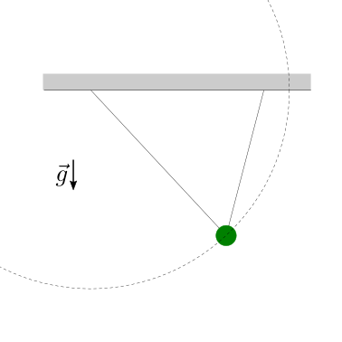

(physics-hs:thermodynamics:foundation:problems)=
# Problemi

## **todo** ... 
<!-- Esercizio ************************************************************* -->
::::{grid}
:gutter: 2

:::{grid-item-card} Problema ... Manometro di Torricelli
:columns: 8

:::

:::{grid-item-card} 
:columns: 4

<!---->
<!-- *Didascalia, se necessaria* -->
:::

::::

```{dropdown} Soluzione.
```

## Calorimetria

<!-- Esercizio ************************************************************* -->
::::{grid}
:gutter: 2

:::{grid-item-card} Problema ... Calore latente - B.Franklin *Cooling by Evaporation*
:columns: 8

:::

:::{grid-item-card} 
:columns: 4

<!---->
<!-- *Didascalia, se necessaria* -->
:::

::::

```{dropdown} Soluzione.
```

<!-- Esercizio ************************************************************* -->
::::{grid}
:gutter: 2

:::{grid-item-card} Problema ... Calore latente - J.Black *Lectures on the Elements of Chemistry: Delivered in the University of Edinburgh*
:columns: 8

- ...
- Durante i suoi esperimenti, J.Black scopre che una massa $m$ di acqua a temperatura $T_1 = 176 \, °F$ è necessaria e sufficiente per sciogliere una massa uguale di ghiaccio a temperatura costante $T_0 = 32 \, °F$. 
- ...
:::

:::{grid-item-card} 
:columns: 4

<!---->
:::

::::

```{dropdown} Soluzione.
```

<!-- Esercizio ************************************************************* -->
::::{grid}
:gutter: 2

:::{grid-item-card} Problema ... Calore latente - Refrigeratore evaporativo
:columns: 8

Qualche applicazione...
:::

:::{grid-item-card} 
:columns: 4

<!---->
<!-- *Didascalia, se necessaria* -->
:::

::::

```{dropdown} Soluzione.
```

<!-- Esercizio ************************************************************* -->
::::{grid}
:gutter: 2

:::{grid-item-card} Problema ... Calore latente - Sudore e termoregolazione
:columns: 8

Refrigerazione evaporativa tramite evaporazione del sudore sulla pelle
:::

:::{grid-item-card} 
:columns: 4

<!---->
<!-- *Didascalia, se necessaria* -->
:::

::::

```{dropdown} Soluzione.
```


